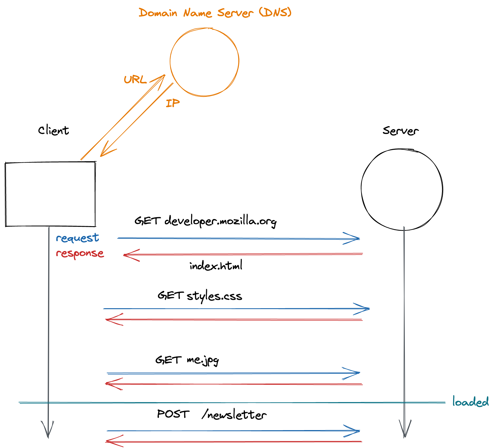
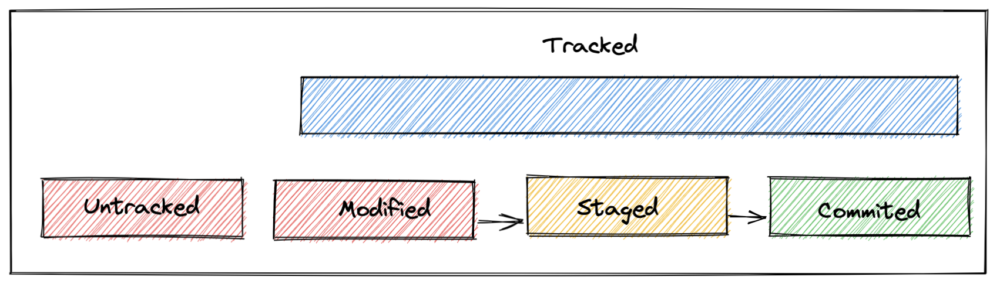
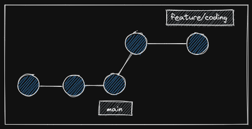

# GitHub and Markdown

## Learning Objectives

- learning what version control is and why it is useful / important
- creating repositories on GitHub
- creating / editing files on GitHub
- creating commits on GitHub
- learning what Markdown is
- writing Markdown

---

## Markdown

The Markdown syntax allows writing formatted text (headlines, blockquotes, lists, etc.) that can be
stored in plain text. It is used by tools and websites like GitHub or Slack. It uses specific
characters to format parts of the text in a certain way.

### Markdown Examples

| Element                         | Markdown Syntax                   |
| ------------------------------- | --------------------------------- |
| Level 1 headline                | `# Level 1 headline`              |
| Level 2 headline                | `## Level 2 headline`             |
| Level 5 headline                | `##### Level 5 headline`          |
| list item                       | `- list item`                     |
| [ ] done                        | `[ ] checkbox`                    |
| [x] done                        | `[x] checkbox`                    |
| **bold text**                   | `**bold text**`                   |
| _italicized text_               | `_italicized text_`               |
| [link](https://www.example.com) | `[link text](https://www.example.com)` |
| image                           | ``           |
| block quote                     | `> block quote`                   |
| divider                         | `---`                             |
| `inline code block`             | `` `inline code block` ``         |
| `code block`                    | ` ``` code block ``` `            |

See this [Markdown Cheatsheet](https://github.com/adam-p/markdown-here/wiki/Markdown-Cheatsheet) for
more Markdown Syntax.

---

## Git & Commits

Git is an open source version control system that:

- keeps track of all changes made to the source code
- enables developers to easily collaborate on the same project and exchange updates
- enables developers to go back to earlier versions of the source code

### Git Repositories

A Git repository is a place where a project is being saved. It keeps track of all versions of the
project files. Many people can have access to (and work on) the same repository.

### Commits

A commit is a **snapshot of your repository** at a specific point in time. Creating a commit in your
project is similar to hitting the **save** button in a video game.

You can always **go back to any prior commit** and will have all the project files as they were when
you made the commit.

Each commit has a message which should include a descriptive text, so that you and other developers
will know what changes the commit includes.

### Good commit messages

Writing good commit message is an art form in itself. Try to stick to the following rules:

- Be short and descriptive
- Always use english
- The first word should be a verb: "add", "fix", "remove", etc.
- Use imperative and present tense: "add shop page" instead of "added shop page"
- Do not end your commit message with a period
- When in doubt, describe **why** you did something instead of **how**: "fix typo" instead of
  "replaced the letter a with an e in the second word"

Your commit messages are a protocol of all changes made to the code base. Other developers should be
able to understand what happened by reading the commit messages.

---

## GitHub

GitHub is an online platform where you can store, share and collaborate on **remote** git
repositories. With GitHub, the same codebase can be shared and edited across many collaborators.
Many repositories are open source, so you can view the code, create a copy, modify it or use it in
your own projects.

> 💡 Hint: Check out this huge
> [list of GitHub repositories](https://github.com/pawelborkar/awesome-repos) and see what you can
> find there.

At the same time GitHub is a social network for developers and companies. Your GitHub profile will
be a valuable public asset for your future career. You can get in contact with many open source
projects, developers and even companies via GitHub.

> 💡 Even though GitHub is the most popular online git platform, it is by far not the only one.
> There are several alternatives to GitHub, i.e Gitlab or Bitbucket.

<br>
<br>

---

## Resources

- [Markdown Cheatsheet](https://github.com/adam-p/markdown-here/wiki/Markdown-Cheatsheet)
- [GitHub Profile Readme](https://docs.github.com/en/account-and-profile/setting-up-and-managing-your-github-profile/customizing-your-profile/managing-your-profile-readme)
- [List of awesome GitHub profile readmes](https://github.com/abhisheknaiidu/awesome-github-profile-readme)

  Handout:
https://github.com/neuefische/allspice-cgn-fssd-25/blob/main/sessions/github-and-markdown/github-and-markdown.md?plain=1

-----------------------------------------------------------


# Shell Basics

## Learning Objectives

- learning what the terminal and the shell are
- learning to navigate the file system using the shell and the terminal
- learning to create, rename, remove and move files and folders in the filesystem

---

## Shell and Terminal

You are probably used to using GUIs
([Graphical User Interfaces](https://en.wikipedia.org/wiki/Graphical_user_interface)) to interact
with computers.

Often times developers interact with computers using CLIs (Command Line Interfaces) which are text
based user interfaces. That means that you type commands to interact with the computer (create /
move / delete / edit files, install software, change system settings...).

This has the following reasons / advantages:

- Many tools don't have a GUI and can only be used as a CLI.
- You can write scripts (which consist of a number of commands) to automate processes and repetitive
  tasks and ensure they are being run exactly the same way every time they are executed.

On macOS we are using zsh (z shell) as the command interpreter.

By default it is run within the Terminal app. For this course we'll use iTerm and Visual Studio Code
as alternative terminal emulators.

- A shell (like zsh) is the command interpreter that runs and executes commands on your computer and
  outputs results.
- A terminal (like Terminal, iTerm, Visual Studio Code) is a text input and output environment
  (emulating a [hardware computer terminal](https://en.wikipedia.org/wiki/Computer_terminal)) that
  sends commands to the shell and displays its output.

### Basic Shell commands

| command                  | functionality                                                              |
| ------------------------ | -------------------------------------------------------------------------- |
| `ls`                     | list the content of the current directory                                  |
| `cd <foldername>`        | change directory into a folder                                             |
| `cd ..`                  | change into the parent folder                                              |
| `cd ~`                   | change into your home directory                                            |
| `pwd`                    | print the current directory path                                           |
| `touch example.md`       | create a file called "example.md"                                          |
| `mkdir newFolder`        | create a folder called "newFolder"                                         |
| `mv <oldname> <newname>` | move or rename a file                                                      |
| `rm <filename>`          | delete a file permanently (there is no trash bin to recover files!)        |
| `open .`                 | open the current folder in the finder                                      |
| `cat <filename>`         | prints the content of a specific file                                      |
| `curl <url>`             | prints the received content from the specified url. (try `curl ipinfo.io`) |

> 💡 There are a lot of commands for any sort of action you want to perform check out
> [this cheat sheet](https://github.com/RehanSaeed/Bash-Cheat-Sheet) to look up important commands.

---

## Resources

- [Terminal basics](https://mrkaluzny.com/blog/terminal-101-getting-started-with-terminal/)
- [Command line cheat sheet](https://github.com/0nn0/terminal-mac-cheatsheet#english-version)

  Handout
https://github.com/neuefische/allspice-cgn-fssd-25/blob/main/sessions/shell-basics/shell-basics.md?plain=1

---------------------------------------------------------------------------------


# HTML and the web

## Learning Objectives

- understanding client/server communication
- writing HTML code
- knowing about the importance of semantic HTML

## How the Web works

The world wide web is a network of computers that can exchange information with each other. There
are many different protocols that define the rules on how machines communicate. Browsers use HTTP
(Hypertext Transfer Protocol) to communicate with web servers.

- The URL (Uniform Resource Locator) is the unique address of a resource on the web contains a human
  readable domain name, that needs to be resolved to the technical IP (Internet Protocol) address of
  the web server via a DNS (Domain Name Server)
- The browser sends a **GET** (that's an HTTP method) **request** to load a HTML (Hyper Text Markup
  Language) document from a web server
- The web server sends a **response** containing the document
- Often the HTML code contains references to additional resources (CSS (Cascading Style Sheet)
  files, images, etc.), which the browser then also requests from the server
- The browser **renders** the received content to the screen and makes it interactive
- Browsers might also request additional data from servers later via subsequent **GET** or **POST**
  requests

## Web Protocols

There are many different protocols that define the rules on how two machines communicate with
each other, for example:

- requesting and displaying html files via `http` (e.g. opening websites with your browser)
- accessing the shell of another computer via `ssh` or cloning repositories from GitHub via a ssh
  connection
- sending and receiving e-mails via `TLS/SSL`
- Accessing files on a server via `FTP` (file transfer protocol)

For now we are focusing on the most commonly used feature of the web: displaying and interacting
with websites.

In order to view a specific website you have to:

- get the `address` of the server that provides the html file, i.e. the `IP address` (internet
  protocol address).
- send a `GET request` to that address
- request additional resources (CSS files, images, etc.)
- `render` the received content (e.g. via a browser)

Most computers connected to the internet can be reached via an `IPv4` address which consists of 4
numbers in a range from 0 to 255 separated by a dot.

> 💡 Enter this IP address in the address bar of your browser and see what happens:
> `172.217.203.94`.

> 💡 Execute following command in your terminal to get the current IP address of your computer:
> `curl ipinfo.io`.

Just like remembering all the phone numbers of your friends is impractical, remembering the IP
addresses of all the websites is not very user friendly. To solve this problem, websites can be
reached via a `url` like `https://www.neuefische.de`. The browser then requests the IP address of
this website from a `DNS` (domain name server), which is basically a phone book for domains.

Then the browser fetches all necessary content for the website like the html file, CSS and
JavaScript files, images, fonts, etc. As soon as all files have downloaded, the browser displays the
html content, styles it as specified in the style sheet and executes JavaScript code. We can now
interact with the website.

#### A sketch of what a typical request of a web page looks like



---

## HTML Basics

HTML (Hyper Text Markup Language) is used to express text in a structured way. HTML tags indicate
what kind of element is displayed on the website. For example, a headline is written like this:

```html
<h1>I am a headline!</h1>
```

The content considered as headline is wrapped within an **opening tag** and a **closing tag**. The
whole thing is called an **element**.

Elements are nested into each other to create structure and hierarchy.

```html
<h1>I am a <em>headline!</em></h1>
```

Some elements can't contain any other elements and therefore don't have a closing tag. They are
self-closing and called
[_empty elements_](https://developer.mozilla.org/en-US/docs/Glossary/Empty_element).

```html
<hr />
or
<br />
```

### HTML Tag Attributes

Some elements require some more information in order to work properly. This information is
specified via attributes, for example:

- the source of an image
  ```html
  
  ```
- the destination of an anchor element
  ```html
  <a href="https://example.com"> click me </a>
  ```
- the type of an input element
  ```html
  <input type="date" />
  ```

> 💡 The [MDN web docs](https://developer.mozilla.org/en-US/docs/Web/HTML/Attributes) contain
> detailed information about elements and corresponding attributes.

### Layout of an HTML File

Every HTML document starts with a
[doctype](https://developer.mozilla.org/en-US/docs/Glossary/Doctype) followed by the `<html>`
element, which consists of two main parts:

- The `<head>` contains important meta information for the browser like
  - the charset (utf-8)
  - the favicon displayed in the tab
  - the title of the website
  - CSS and JavaScript files needed for the website
- The `<body>` contains the visible content of the website structured by html elements

```html
<!doctype html>
<html>
  <head>
    … meta information, additional links to CSS / JavaScript files …
  </head>
  <body>
    … elements displayed on the web page …
  </body>
</html>
```

### List of Common HTML Elements

| element             | meaning                                                      |
| ------------------- | ------------------------------------------------------------ |
| `<head></head>`     | only once per website, includes meta data and linked files   |
| `<body></body>`     | only once per website, includes the html website content     |
| `<h1></h1>`         | only once per website, a level one heading                   |
| `<h2></h2>`         | a level two heading                                          |
| `<p></p>`           | a paragraph                                                  |
| `<a></a>`           | an anchor (link)                                             |
| ``             | an image (self-closing / empty)                              |
| `<form></form>`     | a form element                                               |
| `<input>`           | an input field (self-closing / empty)                        |
| `<button></button>` | a clickable element equipped with some kind of functionality |

> 💡 A comprehensive [list of all html elements can be found at the MDN web docs](https://developer.mozilla.org/en-US/docs/Web/HTML/Element#inline_text_semantics).

---

## Structuring a Website

Developers have two main tools to express a meaningful structure in a website:

1.  Using semantic HTML elements
2.  Nesting / grouping of HTML elements

### Semantic HTML

Semantic HTML elements not only divide the content of the web page into distinct parts, but also
describe the function or purpose of the elements. This has two major benefits:

- The HTML becomes more understandable for other developers
- Accessibility tools and search engines can interpret the website

Therefore, one should use semantic HTML elements whenever possible.

### List of Semantic HTML elements

| element                 | meaning                                                                                                             |
| ----------------------- | ------------------------------------------------------------------------------------------------------------------- |
| `<main></main>`         | only once per website, includes the main content of the page                                                        |
| `<section></section>`   | a generic standalone section of a document                                                                          |
| `<ul></ul>`/`<ol></ol>` | a list of elements with the same structure, only has `<li>` elements as direct children                             |
| `<nav></nav>`           | a navigation bar                                                                                                    |
| `<aside></aside>`       | element representing a portion of a document whose content is only indirectly related to the main content           |
| `<article></article>`   | representing a self-containing part of the website, which is intended to be independently distributable or reusable |
| `<header></header>`     | representing introductory content, typically a group of introductory or navigational aids                           |
| `<footer></footer>`     | typically contains information about the author of the section, copyright data or links to related documents        |

> 💡 You can find a comprehensive [list of semantic html elements in the MDN web docs](https://developer.mozilla.org/en-US/docs/Glossary/Semantics).

### Nesting HTML elements

Nesting groups elements together in a meaningful way. The element containing the other elements is
called the **parent element**, which contains one or more **child elements**.

The following cases are typical examples of nested elements:

- ```html
  <ul>
    <li>first item</li>
    <li>second item</li>
    <li>third item</li>
  </ul>
  ```
- ```html
  <article>
    <h2>Some headline</h2>
    <p>I am a paragraph…</p>
    <a href="https://www.github.com">a link to another website</a>
  </article>
  ```
- ```html
  <button>
    
    <span> submit </span>
  </button>
  ```

Below is a sketch of how semantic elements can be nested in a web page.<br><br>


## Emmet

Visual Studio Code has a useful tool called Emmet which lets you autocomplete a lot of code by just
typing certain snippets and pressing the <kbd>Tab</kbd> key afterwards. Try these snippets inside an
HTML file and see what happens:

- `!`
- `.highlight`
- `button#red`
- `ul>li.card\*10`

> 💡 You can learn about more Emmet commands in
> [this cheat-sheet](https://docs.emmet.io/cheat-sheet/)

---

## Resources

- [MDN: Introduction to HTML](https://developer.mozilla.org/en-US/docs/Learn/HTML/Introduction_to_HTML)
- [MDN: Getting started with HTML](https://developer.mozilla.org/en-US/docs/Learn/HTML/Introduction_to_HTML/Getting_started)
- [MDN: HTML Elements](https://developer.mozilla.org/en-US/docs/Web/HTML/Element)
- [MDN: Semantic elements: Glossary](https://developer.mozilla.org/en-US/docs/Glossary/Semantics)
- [MDN: HTML attributes](https://developer.mozilla.org/en-US/docs/Web/HTML/Attributes)

Handout:
https://github.com/neuefische/allspice-cgn-fssd-25/blob/main/sessions/html-and-the-web/html-and-the-web.md?plain=1

-----------------------------------------------------------------------------------------------------------

# Git CLI & remote

## Learning Objectives

- using version control locally to create repositories and commits
- understanding different states of files
- synchronizing local repositories with remote repositories

---

## Git CLI

You can create git repositories and commits locally. You can also synchronize your local repository
with a **remote** repository (i.e. on GitHub).

### Creating local repositories

To turn a folder into a git repository you need the following git command:

```shell
cd path/to/my/folder
git init
```

> ❗️ Do not initialize a git repository inside another git repository!  
> To check if a folder has already been initialized you can run the following git command
>
> ```shell
> git status
> ```
>
> Not a git repo:
>
> ```shell
> fatal: not a git repository (or any of the parent directories): .git
> ```
>
> A git repo:
>
> ```shell
> On branch main
> nothing to commit, working tree clean
> ```

---

## States of files

On GitHub, we can create, modify and delete files, the same can be done via the terminal. To
understand how this works, we have to know about the different states a file can have.

### Untracked files

The file has not been added to git.

### Tracked files

Tracked files can be in different states:

| state     | description                        |
| --------- | ---------------------------------- |
| modified  | Has changes since the last commit  |
| staged    | Is included in the next commit     |
| committed | All changes have been saved in git |

---

## Committing in a local repository

We recommend executing the following git commands for every completed task:

> 💡 Hint: Commits help track your progress.  
> Commit early, commit often.  
> Make sure, that your code works as expected.

| Git command               | Git task                                         |
| ------------------------- | ------------------------------------------------ |
| `git status`              | List all files that have changed and their state |
| `git add <filename>`      | Add a file to the stage                          |
| `git commit -m "add foo"` | Create a commit including all staged files       |
| `git log --oneline`       | Show the commit history                          |




---

## Using commits as backups

You can always return to the last committed state of the entire project:

```sh
git restore .
```

You can also restore individual files:

```sh
git restore <filename>
```

---

## Connecting to a remote repository

This enables teams to work on the same remote repository and clone it locally. The remote repository
also serves as a backup.

### Connecting your local repository to a new remote repository

The first thing you need to do is create a new empty remote repository on GitHub. You will then see
some hints e.g. "...or push an existing repository from the command line". **Copy the commands from
GitHub** and execute them in your local project folder.

**Example:**

```
git remote add origin git@github.com:GitHubUsername/repository-name.git
git branch -M main
git push -u origin main
```

### Cloning a remote repository

You can create a copy of the remote repository on your local machine with the following command:

```shell
git clone <url>
```

> 💡 You can find the url of remote repositories on GitHub on the repository page. Please use the
> SSH url.


### Synchronizing local & remote repositories

| Git command | Git task                                    |
| ----------- | ------------------------------------------- |
| `git push`  | Upload content to the remote repository     |
| `git pull`  | Download content from the remote repository |

---

## Resources

- [Connect with SSH Docs on GitHub](https://docs.github.com/en/authentication/connecting-to-github-with-ssh/about-ssh)
- [Git SCM](https://git-scm.com/)
- [Git book](https://git-scm.com/book/en/v2)
- [Git Cheatsheet](https://training.github.com/downloads/github-git-cheat-sheet/)

- Handout:
  https://github.com/neuefische/allspice-cgn-fssd-25/blob/main/sessions/git-cli-and-remote/git-cli-and-remote.md?plain=1

  --------------------------------------------------------------------------
  # Git Branches & PRs

## Learning Objectives

- Git branches and how to use them
- pull requests and how to use them
- how branches and pull requests facilitate collaboration

---

## Git Branches

When working on a project, especially as a team, you want to work on features independently, so they
never affect anyone else's work. Git offers us **branches** to keep our current work away from a
teams common codebase until completion.

A branch lets you split from the main line of development. The new branch shares a part of its
commit history with the main branch. At a certain commit the new branch branches off and the commit
histories differ.



The teams common codebase is typically kept in the "main" branch. If you work on a new feature you:

1. create a new **feature branch** and work on that new branch.
2. commit your work on the new branch - the main branch is not effected.
3. finish work on the new feature, test the new functionality and have other developers review your
   work.
4. **merge** your feature branch into the main branch, so all your work is included in the main
   branch.

## Naming branches

It is good practice to use short descriptive names for your feature branches, e.g. "contact-form".
We recommend using hyphens as separators as they make the name more comfortable to read.

### Git `branch` commands

| command                      | functionality                        |
| ---------------------------- | ------------------------------------ |
| `git switch -c <branchname>` | create a new branch and switch to it |
| `git switch <branchname>`    | switch branches                      |
| `git branch`                 | list your branches                   |
| `git branch -a`              | list all branches (local and remote) |
| `git branch -d <branchname>` | delete a branch                      |

## Git pull requests

GitHub offers us **pull requests** (PR) which we can use as a convenient way to request reviews of
the work on a feature branch.

A pull request is a request to merge one branch into another branch. Other developers review the PR
and suggest changes. If a pull request is approved we can merge the feature branch into the main
branch.

### Basic Workflow for a pull request

1. Create a new branch with `git switch -c <branchname>`.
2. Make changes to the code / write your code fpr the feature.
3. Push the changes and the new branch with `git push -u origin <branchname>` (after you have done
   this once you can use `git push` for this branch)
4. Create a pull request on GitHub from the new branch into main
5. Share the pull request with your team
6. Review the pull request, implement changes if needed, push again to update the pull request until
   it gets approved
7. Merge the pull request into main
8. Don't forget to `git pull` inside the main branch on your local machine
9. Delete the new branch on GitHub and locally


---

## Resources

- [About branches](https://docs.github.com/en/pull-requests/collaborating-with-pull-requests/proposing-changes-to-your-work-with-pull-requests/about-branches)
- [Git Branching - Branches in a Nutshell](https://git-scm.com/book/en/v2/Git-Branching-Branches-in-a-Nutshell)

- Handout:
  https://github.com/neuefische/allspice-cgn-fssd-25/blob/main/sessions/git-branches-and-prs/git-branches-and-prs.md?plain=1

  --------------------------------------------------------------------------------

  
