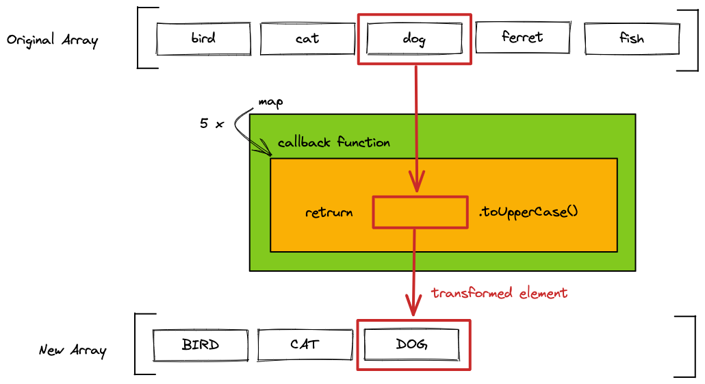

# JS Basics and Variables

## Learning Objectives

- Understanding what JavaScript is
- Getting to know the JS console, working with `console.log()` / `console.clear()`
- knowing the difference between `var`, `let` and `const`
- understanding the different data types
- using basic math operations

---

## JavaScript

JavaScript is a programming language originally designed to run in the browser. Since 2009, JavaScript can also be executed outside the browser using a program called `Node.js`. This program interprets JavaScript syntax and follows the instructions provided.

A JavaScript program consists of a series of instructions that are executed sequentially, one after another. For example:

```js
console.clear(); // executed first
const text = "Hello World!";
console.log(text); // executed last
```

It is important to follow syntax rules precisely; otherwise, `Node.js` won’t understand your instructions. For example, you _must_ place a `.` (dot) between `console` and `clear`—with nothing in between.

```js
console.log("hey"); // works!
consolelog("hey"); // wrong syntax -> fails!
console.log<"hey">; // also wrong syntax -> fails!
```

Learning these syntax rules is like learning a new language, a programming language! But where humans can understand you despite syntax errors, computers cannot! So make sure that you have a good understanding of all syntax rules you come across.

## Hello World: `console.log()`

In JavaScript, we can print text to the terminal, also known as the console. This is useful for tasks such as debugging or error logging.

```js
console.log("Hello World!"); // logs into console
console.clear(); // clears console
console.error("Error!"); // logs as error into console
```

---

## Variable Declarations

Variables act as a _reference_ or _alias_ for data stored in memory. You can access and manipulate this data using the variable name. In JavaScript, there are three different keywords to declare a variable:

- `const`: Declares a constant variable, meaning the value cannot be changed. This is the preferred way to declare variables.
- `let`: Declares a variable whose value can be changed. Use `let` only when you need to reassign a new value.
- `var`: This is outdated and should no longer be used.

Normally the keyword `const` is used to declare a variable.

```js
const aNewVariable = 1234;
```

The keyword `let` is only used when you need to reassign a value, for example when you want to
increase a counter.

```js
let counter = 0;
counter = counter + 1; // reassigning the value of counter
```

The `=` sign in programming doesn't quite work like the mathematical equality that you (maybe)
remember from school. It means: "the value of the item on the right of the equal sign is saved in
the item on the left of it". What the item on the right actually represents is calculated first and
saved afterwards.

## Primitive Data Types

JavaScript is a dynamically typed language, which means, that you don't have to specify what kind of
value you want to store, JavaScript detects this automatically.

There are 7 primitive data types:

| type        | represents                                                                                                                  |
| ----------- | --------------------------------------------------------------------------------------------------------------------------- |
| `string`    | a sequence of characters: "abcd"                                                                                            |
| `number`    | a number: 1234                                                                                                              |
| `boolean`   | a binary statement, can be `true` or `false`                                                                                |
| `null`      | represents "nothing", is typically set by developers                                                                        |
| `undefined` | represents the state of "not existing". Anything not specified or not found in JavaScript defaults to the value `undefined` |
| `BigInt`    | uncommon, used for integers larger than 9007199254740991                                                                    |
| `Symbol`    | uncommon, used for creating unique elements                                                                                 |

## Variable Naming

Expressive variable names are very important for the `readability of the code`. The Code becomes
easier to understand and needs less comments. There are some key guidelines you should follow when
naming a variable:

- use camel case: `socialFeedEntry` instead of `socialfeedentry`
- write out all words: `error` instead of `e`, `followerButton` instead of `flBtn`
- be very specific, longer names are better than shorter: `updatedFollowerCounter` instead of
  `counter`.

## Math & Operators

As a programmer you sometimes have to use mathematical operations to calculate certain widths or
positions of elements. Operators calculate values based on one or two expressions.

| operator | effect                                                                                       |
| -------- | -------------------------------------------------------------------------------------------- |
| `+`      | adds two numbers together.                                                                   |
| `-`      | subtracts two numbers                                                                        |
| `*`      | multiplies two numbers                                                                       |
| `/`      | divides two numbers                                                                          |
| `**`     | potentiates two numbers: `2 ** 4 → 16`                                                       |
| `%`      | The remainder or modulus. Gives you what remains after a whole number division: `8 % 3 → 2`. |

The remainder is a very useful operator, but might be difficult to understand at first. A real life
example would be time on a clock. After noon, you don't reach 13am but you start over at 1pm. 3
hours after midnight you don't have 15pm (or 27h in the 24h format), but 3am. It is whatever hour we
have mod 12:

```js
5 % 12; // → 5
12 % 12; // → 0
13 % 12; // → 1
15 % 12; // → 3
27 % 12; // → 3
```

You can also use this operator to determine if a number is even or odd:

```js
6 % 2; // → 0
```

This is `0` for all **even** numbers, because after dividing an even number by `2` nothing remains.

```js
5 % 2; // → 1
```

This is `1` for all **odd** numbers, because after this division you have always `1` left over.

## Operator Precedence

In maths, some operators have a higher precedence than others. This means that they are performed
before operators with a lower precedence. For example, multiplication comes before addition.

> 📙 You can read more about [**Operator precedence** in the mdn](https://developer.mozilla.org/en-US/docs/Web/JavaScript/Reference/Operators/Operator_Precedence).

> 💡 If you are uncertain, use parentheses around calculations to denote precendence manually. Prettier
> will remove any unnecessary parentheses from your expression automatically.

## Assignment Operators

You already know the default assignment operator `=`. This operator just assigns the value on the
right to the element on the left. There are more assignment operators for very common actions like
increasing a variable by a fixed value.

| operator | effect                                                                                                               |
| -------- | -------------------------------------------------------------------------------------------------------------------- |
| `+=`     | Increases the value of the variable on the left about the value on the right: `count += 6` → count is increased by 6 |
| `-=`     | Decreases the value of the variable on the left about the value on the right                                         |
| `*=`     | Multiplies the variable on the left with the value on the right                                                      |
| `/=`     | Divides the variable on the left with the value on the right                                                         |
| `++`     | Increments the value of a variable by one: `count++` → count is increased by one                                     |
| `--`     | Decrements the value of a variable by one: `count--` → count is decreased by one                                     |

## Type Coersion

When you use an operator with a variable with an unfitting type, JavaScript will automatically
convert (coerse) this variable into a fitting type. For example:

```js
4 / "2"; // → 4 / 2
```

There is no "/" operator for strings, so JavaScript converts the string into a number if possible.
This is also true for boolean operators which we will cover in a later session.

> ❗️ There is another `+` operator in JavaScript, that links two strings together: `"a" + "b"` →
> `"ab"`. When 'adding' a number and a string, the number is converted to a string: `"a" + 6` → `"a6"`.
> Make sure that both variables are numbers if you want to add them.

> 📙 Read more about [**Type coersion** in the mdn](https://developer.mozilla.org/en-US/docs/Glossary/Type_coercion).

## Number Systems

When working with computers, it is sometimes useful to work with a different number system than the
standard 10 digit system, since a computer only understands `binary` numbers composed of only 0
and 1. You don't have to learn these systems by heart, but it is good if you heard about them.

- `decimal system`: the standard numbers, has 10 symbols "0" to "9".
- `binary system`: only has 2 symbols "0" and "1". If you want to write a bigger number than 1, you
  add another digit: 2 → "10" in binary.
- `hexadecimal system`: has 16 symbols "0" to "9" and "a" to "f". If you want to write a number
  bigger than 15 you add another digit: 12 → "c" in hexadecimal.

---

## Resources

- [Operator Precedence in the mdn](https://developer.mozilla.org/en-US/docs/Web/JavaScript/Reference/Operators/Operator_Precedence)
- [Type coersion in the mdn](https://developer.mozilla.org/en-US/docs/Glossary/Type_coercion)

  Handout:
  https://github.com/neuefische/allspice-cgn-fssd-25/blob/main/sessions/js-basics-and-variables/js-basics-and-variables.md?plain=1
  ------------------------------------------------------------------------------------------------------------------------------------------------
# JS DOM and Events

## Learning Objectives

- Connect a JavaScript file with `<script>`
- Log to the console
- Select elements with `querySelector`
- Add, remove and toggle CSS classes on `click` with `addEventListener`

---

## Connect a JavaScript file

```html
<head>
  ...
  <script src="./index.js" defer></script>
</head>
<body>
  ...
</body>
```

The `script` tag has two attributes:

`src="./index.js"` sets the URL to our JavaScript file

`defer` tells the browser to delay the loading of the script until all HTML elements are loaded.

> 💡 Alternative: `script` tag at the end of the body element, so `defer` attribute is not
> necessary. Less modern.

```html
<head>
  ...
</head>
<body>
  ...
  <script src="./index.js"></script>
</body>
```

---

## The DOM

In order to access and manipulate elements of our web page from inside our JavaScript file, we can use the `DOM` - Document Object Model. It contains every element of our HTML document represented as a JavaScript object. We will learn about objects in a later session.

In a JavaScript file the DOM is stored in a variable called `document`.

```js
console.log(document);
console.log(document.head);
console.log(document.body);
```

With the help of this variable we can find, create and manipulate elements on our web page.

## Selecting HTML Elements: `.querySelector()`

Before we can add interactivity, we need to select the necessary HTML-Elements:

```html
<body>
  <main class="main" id="main" data-js="main">...</main>
</body>
```

There are multiple ways to select the main section above in JavaScript. A good practice is to use a [data-\* attribute](https://developer.mozilla.org/en-US/docs/Web/HTML/Global_attributes/data-*), such as `data-js`, as shown in the following example.

```js
const mainElement = document.querySelector('[data-js="main"]');
```

Other CSS selectors work as well, but the `data-*` attribute selectors should be preferred.

```js
// tag as identifier
const mainElement = document.querySelector("main");
// class as identifier -> .
const mainElement = document.querySelector(".main");
// id as identifier -> #
const mainElement = document.querySelector("#main");
```

> 💡 We try to separate our concerns: Classes are for CSS and `data-*` attributes are for JavaScript.

---

## Add Interaction: `.addEventListener()`

We can listen to **events** like **clicks** on an element and execute code when the event is triggered. The method `addEventListener` is used to react to events.

```html
<button type="button" data-js="button">Log into console</button>
```

```js
const button = document.querySelector('[data-js="button"]');
button.addEventListener("click", () => {});
```

First, you specify the type of event (e.g., `click`), and then you define the code to be executed when the event is triggered. This code is written inside the `{}` brackets, such as a `console.log` statement.

```js
const button = document.querySelector('[data-js="button"]');
button.addEventListener("click", () => {
  console.log("Yeah");
});
```

There different events you can listen to, for example:

```js
button.addEventListener("mouseover", () => {});
```

```js
button.addEventListener("keydown", () => {});
```

> 💡 Here you can find a
> [list of event types](https://developer.mozilla.org/en-US/docs/Web/Events#event_listing).

> 💡 You don't have to understand the syntax for now, we will cover this in a later session.

---

## Add/remove & toggle classes: `.classList.`

You can add, remove, or toggle classes to change the styling of an element. For example:

```html
<main data-js="main">
  <button type="button" data-js="button">Add a class</button>
</main>
```

To add the `page--primary` class to the main section, you can use the `classList.add` method like this:

```js
const main = document.querySelector('[data-js="main"]');
const button = document.querySelector('[data-js="button"]');

button.addEventListener("click", () => {
  main.classList.add("page--primary");
});
```

A click on the button adds the class `page--primary` to the main element:

```html
<main data-js="main" class="page--primary">
  <button type="button" data-js="button">Add a class</button>
</main>
```

You can also remove or toggle a class in the same way:

```js
main.classList.remove("page--primary");
```

```js
main.classList.toggle("page--primary");
```

---

## Resources

### Connect a JavaScript file

[The Script element](https://developer.mozilla.org/en-US/docs/Web/HTML/Element/script)

### Hello World

[Console](https://developer.mozilla.org/en-US/docs/Web/API/Console)

### Selecting HTML Elements

[Document](https://developer.mozilla.org/en-US/docs/Web/API/Document)

[Using data attributes](https://developer.mozilla.org/en-US/docs/Learn/HTML/Howto/Use_data_attributes)

[document.querySelector](https://developer.mozilla.org/en-US/docs/Web/API/Document/querySelector)

[data-\* attribute](https://developer.mozilla.org/en-US/docs/Web/HTML/Global_attributes/data-*)

### Add Interaction

[.addEventListener()](https://developer.mozilla.org/en-US/docs/Web/API/EventTarget/addEventListener)

[Event reference](https://developer.mozilla.org/en-US/docs/Web/Events#event_listing)

### Add/remove & toggle classes

[classList](https://developer.mozilla.org/de/docs/Web/API/Element/classList)

Handout:
https://github.com/neuefische/allspice-cgn-fssd-25/blob/main/sessions/js-dom-and-events/js-dom-and-events.md?plain=1
  
  ------------------------------------------------------------------------------------------------------------------------------------------------

  # JS Conditions and Booleans

## Learning Objectives

- using conditions to control the program flow
- understanding what booleans and truthy/falsy values are
- working with comparison and logical operators
- writing ternary expressions

---

## Boolean Values

A boolean value, named after George Boole, only has two states. It can either be **true** or
**false**. Booleans are often used in conditional statements which can execute different code
depending on their value.

## Truthy and Falsy Values

Sometimes you want to have a condition depending on another type of value. JavaScript can transform
any value into a boolean with _type coercion_. That means that some values act as if they were true
and others as if they were false: _Truthy_ values become true, _falsy_ values become false.

- _truthy_ values:

  - non zero numbers: `1`, `2`, `-3`, etc.
  - non empty strings: `"hello"`
  - `true`

- _falsy_ values:
  - `0` / `-0`
  - `null`
  - `false`
  - `undefined`
  - empty string: `""`

---

## Comparison Operators

Comparison operators produce boolean values by comparing two expressions:

| Operator  | Effect                                                                           |
| --------- | -------------------------------------------------------------------------------- |
| A `===` B | strict equal: is `true` if both values are equal (including their type).         |
| A `!==` B | strict not equal: is `true` if both values are not equal (including their type). |
| A `>` B   | strictly greater than: is `true` if A is greater than B.                         |
| A `<` B   | strictly less than: is `true` if A is less than B.                               |
| A `>=` B  | greater than or equal: is `true` if A is greater than or equal B.                |
| A `<=` B  | less than or equal: is `true` if A is less than or equal B.                      |

> 💡 You might notice that JavaScript uses three equal signs (`===`) to check for equality. This can
> seem very strange at first.
>
> - `=` (`const x = 0`) is the assignment operator and has nothing to do with comparison.
> - `==` and `!=` are non-strict equality operators. You should **avoid them 99% of the time**.  
>   Non-strict equality tries to use type coercion to convert both values to the same type:
>   `"3" == 3` is `true`, which is seldomly what you want.
> - `===` and `!==` are strict equality operators. **This is what you need almost always**.  
>   Strict equality checks if type _and_ value are the same: `"3" === 3` is `false`.

---

## Logical Operators

Logical operators combine up to two booleans into a new boolean.

| Operator                      | Effect                                                 |
| ----------------------------- | ------------------------------------------------------ |
| `!`A                          | `not`: flips a `true` value to `false` and vice versa. |
| A <code>&#124;&#124;</code> B | `or`: is `true` if either A `or` B is true.            |
| A `&&` B                      | `and`: is `true` if both A `and` B is true.            |

> 💡 You can combine logical operators with brackets to define which operator should be evaluated
> first, e.g:
>
> - `(A || B) && (C || D)`
> - `!(A || B)`

> 💡 Be careful when using `&&` or `||` with non-boolean values. They actually return one of the
> original values. That can be useful, but can also quickly lead to confusion. This behaviour is
> called
> [short-circuit evaluation](https://developer.mozilla.org/en-US/docs/Web/JavaScript/Reference/Operators/Logical_AND#short-circuit_evaluation)
> and is a more advanced topic.
>
> - `"some string" || "some other string"` evaluates to `"some string"`
> - `0 || 100` evaluates to `100`
> - `null && "yet another string"` evaluates to `null`

---

## Control Flow: `if / else`

With an if statement we can control whether a part of our code is executed or not, based on a
condition.

```js
const isSunShining = true;

if (isSunShining) {
  // code that is executed only if condition "isSunShining" is true
}
```

The else block is executed only if the condition is `false`.

```js
const isSunShining = false;

if (isSunShining) {
  // code that is executed only if condition "isSunShining" is true
} else {
  // code that is executed only if condition "isSunShining" is false
}
```

The condition expression between the `()` brackets can be composed of logical or comparison
operators as well. You can distinguish between more cases by chaining `else if` statements:

```js
if (hour < 12) {
  console.log("Good Morning.");
} else if (hour < 18) {
  console.log("Good afternoon.");
} else if (hour === 24) {
  console.log("Good night.");
} else {
  console.log("Good evening.");
}
```

If the condition is not a boolean, it is converted into one by type coercion. This can be used to
check whether a value is not 0 or an empty string:

```js
const name = "Alex";
if (name) {
  console.log("Hi " + name + "!"); // only executed if name is not an empty string
}
```

---

## Ternary Operator: `? :`

With if / else statements whole blocks of code can be controlled. The ternary operator can be used
if you want to decide between two _expressions_, e.g. which value should be stored in a variable:

```js
const greetingText = time < 12 ? "Good morning." : "Good afternoon.";
```

The ternary operator has the following structure:

```js
condition ? expressionIfTrue : expressionIfFalse;
```

If the condition is true, the first expression is evaluated, otherwise the second expression. The
ternary operator can be used to decide which function should be called:

```js
isUserLoggedIn ? logoutUser() : loginUser();
```

It can also distinguish which value should be passed as an argument to a function:

```js
moveElement(xPos > 300 ? 300 : xPos); // the element can't be moved further than 300.
```

> ❗️ The operator can only distinguish between two _expressions_ like values, math / logical
> operations or function calls, not between _statements_ like variable declarations, if / else
> statements or multi-line code blocks.

---

## Switch Statement

Sometimes, we need to check if a variable or expression matches one of several specific values. In such cases, a `switch statement` provides a clearer and more efficient solution than using multiple `if...else` statements.

The `switch` statement works by taking the variable or expression, then moving sequentially through a list of possible **cases** for its value. In each `case` that it gets to, it compares the checked value with the case's value. If they match, the code in this `case` will be run. If they don't match, JavaScript will move on to the next `case` in the sequence.

Here's an example:

```js
console.log("Which is your favorite season of the year?");
const userAnswer = "spring";

switch (userAnswer) {
  case "summer":
    console.log("Heat, sun and waves for you 😎");
    break;
  case "autumn":
    console.log("Crunchy, colorful leaves and cool breezes 🍁");
    break;
  case "winter":
    console.log("Ice, snow, warm clothes and hot drinks ☕️");
    break;
  case "spring":
    console.log("Growth, green, and new beginnings! 🌿");
    break;
  default:
    console.log("Sorry, I don't think that's a season!");
}
```

💡 Syntax guidelines for the `switch` statement:

- Similar to an `if` statement, the evaluated value or expression should be placed inside parentheses `()`.
- The entire body of the `switch` statement must be enclosed in curly braces `{}`, just like an `if` statement.
- Each `case` specifies a single constant value (not an expression) to compare against.
- A colon `:` must follow each `case` value.
- By default, all cases of a `switch` statement are checked, even if a case already matched before. This "fall-through" behavior is seldom what we want and can be prevented with a `break` statement. When executed it terminates the `switch` statement immediately, similar to the `return` statement of a function.
- It's advisable to include a `default` case to handle unmatched values; this does not require a `break`.

---

## Advanced: The strangeness of boolean coercion and making use of non-strict equality

<details>
<summary>🫣 This is an advanced topic and not important for the challenges. Click to expand if you're curious.</summary>

Assume you want to check if a variable has a useful value for us to work with. `if(variable)` does
in fact not check if `variable` is defined but rather if it is truthy. Take a look at these
examples:

- `if(undefined)` → falsy, won't execute
- `if(null)` → falsy, won't execute
- `if("")` → falsy, won't execute, but might still be a useful variable  
  (e.g. when user clears an input field)
- `if(0)` → falsy, won't execute, but might still be a useful variable  
  (e.g. when user wants to set the volume to `0`)
- `if(" ")` → truthy, will execute
- `if(-1)` → truthy, will execute

It's useful to define a variable as not having a value when it's `undefined` or `null`. We can check
for that like this:

```js
if (variable != null) {
  console.log('This will be logged even if variable is 0 or ""');
}
```

This is one of the rare valid use cases for non-strict comparison (`!=` instead of `!==`).

JavaScript tries to coerce the compared values into the same type. And just like `"3" == 3` is
`true`, `undefined == null` is also `true`. This also works with `!=` instead of `==`.

> ⚠️ Remember that this is an exception for using non-strict equality. **Strict equality should
> otherwise always be preferred.**

</details>

---

## Resources

### Operators

[MDN Comparison Operators](https://developer.mozilla.org/en-US/docs/Web/JavaScript/Guide/Expressions_and_Operators#comparison_operators)

[MDN Logical Operators](https://developer.mozilla.org/en-US/docs/Web/JavaScript/Guide/Expressions_and_Operators#logical_operators)

### if / else statements

[MDN about if else](https://developer.mozilla.org/en-US/docs/Web/JavaScript/Reference/Statements/if...else)

### Ternary Operator

[MDN Ternary Operator](https://developer.mozilla.org/en-US/docs/Web/JavaScript/Reference/Operators/Conditional_Operator)

### Switch Statements

[MDN about switch](https://developer.mozilla.org/en-US/docs/Web/JavaScript/Reference/Statements/switch)

Handout:

https://github.com/neuefische/allspice-cgn-fssd-25/blob/main/sessions/js-conditions-and-booleans/js-conditions-and-booleans.md?plain=1

  ------------------------------------------------------------------------------------------------------------------------------------------------

  # JS Objects and Arrays

## Learning Objectives

- Creating, accessing, and manipulating arrays
- Creating, accessing, and manipulating objects
- Knowing how to find properties and methods of objects by logging

---

## Why Are Objects and Arrays Essential in JavaScript?

- Objects and arrays are fundamental in JavaScript because they provide the core structure for organizing, storing, and manipulating data in complex and flexible ways.
- Objects and arrays aren’t just data structures in JavaScript; they form the backbone of how data is managed, processed, and transferred, making them essential for writing effective JavaScript.

## Objects

Objects are a structured data type, which couple their values not to an index, but to a unique key.

You can declare an object using `{}` curly brackets (object literals):

```js
const person = {
  name: "Max Paddington",
  age: 21,
  isStudent: false,
};
```

You can access the properties using the dot notation:

```js
person.name; //"Max Paddington"
```

You can also access the properties using the bracket notation:

```js
person["age"]; // 21
```

Objects can be nested:

```js
const person = {
  name: "Max Paddington",
  age: 21,
  isStudent: false,
  address: {
    street: "Berliner Str.",
    houseNumber: 42,
    city: "Leipzig",
    zipCode: "12345",
  },
};
```

Nested values can be accessed by chaining the dot notation and/or the bracket notation together.

```js
person.address.street; // "Berliner Str."
person.address["city"]; // "Leipzig"
```

You can change values of object properties by reassigning them using the dot or bracket notation:

```js
person.name = "Max Paddington";
person["age"] = 33;
```

You can add new properties in the same way:

```js
person.score = 15;
```

You can delete properties using the delete keyword:

```js
delete person.score;
```

---

## Arrays

Arrays are a structured data type which can store multiple values in one variable.

You can declare an array using `[]` square brackets (array literals):

```js
const shoppingList = ["apple", "tomato"];
```

Each item in the array has an index, which starts at 0. You can access individual items using the
bracket notation and the item's index:

```js
shoppingList[0]; // "apple"
shoppingList[1]; // "tomato"
```

Arrays can hold any type of value, even another array. This is called a nested array. The values of
nested arrays can be accessed by choosing the index of the nested array first and then stating the
index of the element inside the nested array.

```js
const nestedArray = ["a", 1, ["a", "new", "sentence"], false];
nestedArray[2][1]; // "new"
```

You can overwrite individual values in an array:

```js
const shoppingList = ["apple", "tomato"];
shoppingList[0] = "banana";
shoppingList; // ["banana","tomato"];
```

### Common Array Attributes and Methods

| Attribute / Method       | Effect                                           |
| ------------------------ | ------------------------------------------------ |
| `array.length`           | returns the number of elements in the array      |
| `array.push(element)`    | adds `element` to the end of the array           |
| `array.pop()`            | removes the last element of an array             |
| `array.unshift(element)` | adds `element` as the first element of the array |
| `array.shift()`          | removes the first element of the array           |

> 💡 There are much more array methods and attributes which we will discover in later sessions. Go
> to the
> [MDN Docs](https://developer.mozilla.org/en-US/docs/Web/JavaScript/Reference/Global_Objects/Array#instance_methods)
> for more information.

---

## Nested Objects / Arrays

Arrays can contain objects and vice versa:

```js
const peopleArray = [
  {
    name: "John",
    age: 22,
  },
  {
    name: "Alex",
    age: 33,
  },
];
```

```js
const user = {
  userId: "1234",
  mail: "test@mail.com",
  shoppingCart: ["tomato", "banana", "chocolate"],
};
```

You can access elements via chained dot / bracket notation:

```js
peopleArray[1].name; // "Alex"
user.shoppingCart[0]; // "tomato"
```

---

## Resources

### Array

[MDN Docs: Array](https://developer.mozilla.org/en-US/docs/Web/JavaScript/Reference/Global_Objects/Array)

### Object

[MDN Docs: Object](https://developer.mozilla.org/en-US/docs/Web/JavaScript/Reference/Global_Objects/Object)

Handout:
https://github.com/neuefische/allspice-cgn-fssd-25/blob/main/sessions/js-objects-and-arrays/js-objects-and-arrays.md?plain=1
  ------------------------------------------------------------------------------------------------------------------------------------------------
  # JS Functions

## Learning Objectives

- Understanding the purpose of functions.
- Writing custom functions with function declarations.
- Naming functions appropriately.
- Using default values.
- Calling functions.
- Using function parameters and passing arguments to function calls.
- Understanding variable scope.
- Returning values from functions.

---

## Functions Purpose

Functions are a fundamental concept in programming that help us avoid repetition and make our code more organised.

Instead of writing the same code repeatedly, you can write it once inside a function and call that function whenever needed.

> 💡 A good analogy for functions is a recipe: a task like baking a cake is written down in a recipe. This cake can then be baked simply by looking up that recipe and following the instructions.

---

## Function Declarations

You can define a function using a `function declaration`, which consists of:

- The keyword `function`, which goes first.
- A function `name`, which should describe its purpose.
- A single `parameter` or a list of `parameters` between the parentheses `()`.
- A function `body`, which contains the JavaScript code, between the curly braces `{}`.

> 💡 Defining a function doesn't execute its code; you must call the function to run the code.

```js
function functionName() {
  // Function body
}

function bakeCake() {
  console.log("Mix the ingredients.");
  console.log("Pour the batter into a pan.");
  console.log("Bake at 180°C for 30 minutes.");
}
```

> 💡 A `function declaration` is exactly this set of instructions of the cake recipe. But a declaration does nothing by itself (you cannot eat the recipe, but only the cake). You can then execute the instructions by `calling the function`.

> 💡 A function should do only what its name suggests. Separate independent actions into different functions.

---

<details>
<summary>Naming Functions</summary>

## Clear and Descriptive Function Names

- Functions represent actions, so their names should be verbs.
- The name should be brief, accurate, and describe what the function does.
- This helps others developers understand the function's purpose just by reading its name.

### Common Prefixes

Prefixes indicate the function's action. Agree on their meanings within your team.

Examples:

- `showMessage(...)` – displays a message.
- `getPeople(...)` – returns a list of persons.
- `createCard(...)` – creates and usually returns a card UI element.
- `checkStatus(...)` – checks the status and returns true/false..
- `handleSubmit(...)` – handles a form submit event.

</details>

---

## Function Calls

- Without calling the function, it will do nothing.
- Functions can be called by their names and followed by parentheses `()`, to execute the code inside the function `body`.

```js
bakeCake();
```

> 💡 Execute the recipe instructions, aka baking the cake, by `calling the function`

- Functions can be called as many times as needed.
- This highlights one of the main purposes of functions: to avoid code duplication.

```js
bakeCake();
bakeCake();
```

> 💡 Fun fact: We have already called built-in browser functions (or methods which are associated with objects) like `console.log()` and `addEventListener()`. These are functions provided by the browser and the JavaScript language itself and are ready to use or "call" without any additional code.

---

## Function Parameters

- A function that always shows the same message isn't very useful.
- Adding parameters makes a function more flexible by allowing different inputs.
- Functions use `parameters` like predefined variables inside the function body.
- You can name parameters freely, except for [reserved words](https://developer.mozilla.org/en-US/docs/Web/JavaScript/Reference/Lexical_grammar#reserved_words).
- When defining a function, these variables are called `parameters`
- When calling a function, the values passed are called `arguments`.
- When the function is called, the given values become `local variables` that the function uses.

To clarify these terms:

> 💡 A `parameter` is the variable listed inside the parentheses in the function declaration (declaration-time term).

> 💡 An `argument` is the value that is passed to the function when it is called (call-time term).

```js
//           parameter ↓
function printLetter(name) {
  console.log("Hi " + name + ", hope you are fine. Your Mum");
}

//    argument ↓
printLetter("Alice");

//             parameters ↓
function printSum(first, second, third) {
  const sum = first + second + third;
  console.log("The sum of your numbers is: " + sum);
}
//   arguments ↓
printSum(3, 6, 9);
```

---

<details>
<summary>Default Values</summary>

- Sometimes a function is called without passing an argument.
- In this case, the corresponding parameter becomes `undefined`. This is not an error but could be unintentional.
- To handle this, we can use `default values` in the function declaration.
- These values are used if the argument is omitted.

```js
function printLetter(name = "Child") {
  console.log("Hi " + name + ", hope you are fine. Your Mum");
}

// Function calls
printLetter("Alice"); // Output: "Hi, Alice!"
printLetter(); // Output: "Hi, Child!"
```

</details>

---

## Variable Scope

Scope defines where variables are available and where they can be referenced (or used) in your code.

- Variables declared inside a function are `local` to that function and can only be accessed from within it. They are not available outside the function.

```js
function printLetter() {
  // local variable
  const name = "Alice";
  console.log("Hi " + name + ", hope you are fine. Your Mum");
}
printLetter(); // Output: "Hi Alice, hope you are fine. Your Mum"
console.log(name); // 🚫 Error! The variable is not available outside of  the function
```

- If a same-named variable is declared inside the function, it shadows the outer one.
- The `local` variable takes precedence, and the `global` variable is not accessible within that function.
- The outer variable remains unchanged and accessible outside the function.

```js
const name = "Alice";

function printLetter() {
  const name = "Max";
  console.log("Hi " + name + ", hope you are fine. Your Mum");
}

printLetter(); // Output: "Hi Max, hope you are fine. Your Mum"
console.log(name); // Output: "Alice"
```

> 💡 It’s a good practice to minimize the use of global variables.

---

## Returning a value

- Some functions, don't return a value, but others do.
- A function can `return` a value back into the calling code (or variable) as the result.
- `Return values` are values that a function "sends back" when it completes.
- To return a value from a function, use the `return` keyword followed by an expression (anything that produces a value, see Link to the Blog Arcticl "Statements vs. Expressions" by Josh W. Comeau).
- The `return` keyword can be placed anywhere in the function.
- When the execution reaches `return`, the function stops, and the value is returned to the calling code.

```js
function calculateSum(a, b) {
  const sum = a + b;

  return sum;
}

const firstSum = calculateSum(2, 3);
// The return value is stored in "firstSum", namely 5

const secondSum = calculateSum(4, 123);
// The return value is stored in "secondSum", namely 127
```

- A function can return only one `expression value`, but there can be multiple `return statements`, in a single function.

_For example, in combination with `if-else statements`_

```js
function checkInputLength(inputString) {
  if (inputString.length > 3) {
    return true;
  } else {
    return false;
  }
}

const isValid = checkInputLength("Hey!");
```

---

> 💡 In conclusion, the best way to master functions is through practice. Reading is beneficial, but maintaining a consistent routine and regular practice is most effective. Keep practicing by writing your own functions, experimenting with different parameters and return values. This will deepen your understanding and enhance your skills over time.

---

### Bonus Knowledge

<details>
<summary>Early Return Statements</summary>

- You can use `return` by itself to make the function exit immediately, without returning a value.

For example, the following `console.log()` is never executed because the function exits before reaching it:

```js
function testFunction() {
  return "a returned string";

  console.log("I am never logged in the console.");
}
```

- This behavior is useful for creating `early return statements`.
- `Early returns` let us run specific parts of our code only if certain conditions are met.
- This can make our code cleaner and easier to understand, especially when there are multiple conditions.

Consider this example with nested conditions:

```js
function setBackgroundColor(color) {
  if (typeof color === "string") {
    if (color.startsWith("#")) {
      if (color.length >= 7) {
        document.body.style.backgroundColor = color;
      }
    }
  }
}
```

Using early return statements, we can rewrite the function like this:

```js
function setBackgroundColor(color) {
  // First condition
  if (typeof color !== "string") {
    return;
  }

  // Second condition
  if (!color.startsWith("#")) {
    return;
  }

  // Third condition
  if (color.length < 7) {
    return;
  }

  // If all conditions are met, execute this line
  document.body.style.backgroundColor = color;
}
```

> 💡 Hint: A return statement can be left empty, the returned value is then `undefined`.

</details>

<details>
<summary>Arrow Functions</summary>

In addition to function declarations, JavaScript has a very simple and concise syntax for creating functions, called `arrow functions`.

The function is assigned to a `constant variable`, which means its reference cannot be changed. The syntax is as follows:

```js
const addNumbers = (first, second) => {
  return first + second;
};
```

- `const`: Declares a variable with a constant reference to the function.
- `functionName`: The name of the variable storing the function.
- `(parameters)`: List of parameters inside parentheses, separated by commas.
- `=>`: Fat arrow indicating an arrow function.
- `{}`: Curly braces containing the function body.

### Implicit Return Statements

The advantage of arrow functions are possible shorter notations when certain criteria apply:

1. Omit the round brackets around the parameters: This is possible, if there is only one input.

```js
const addOne = (number) => {
  return number + 1;
};
```

2. Implicit return statements: If the function consists only of a return statement, the curly
   brackets and the return keyword can be omitted.
   ```js
   const addNumbers = (first, second) => {
     return first + second;
   };
   ```
   can be rewritten as:
   ```js
   const addNumbers = (first, second) => first + second;
   ```

> 💡 Maybe you remember the syntax of the `addEventListener` method. We encountered these arrow
> functions there already!
>
> ```js
> button.addEventListener("click", () => {
>   // ...
> });
> ```

</details>

<details>
<summary>Callback Functions</summary>

A callback function is a function that is passed **as an argument** into another function to be executed later.

The outer function can execute this callback function at the correct moment or multiple times, for example:

- when an event is triggered
- when the fetched data arrived on your computer
- for each element in an array.

Callback functions are used whenever the program itself needs to determine **when** or **how many times** the function should be executed.

We already used callback functions in **event
listeners**:

```js
button.addEventListener("click", () => {
  console.log("Inside the callback function.");
});
```

Here the structure is as follows:

- outer function: `addEventListener()`
- first argument: `'click'`
- second argument: callback function
  ```js
  () => {
    console.log("Inside the callback function.");
  };
  ```
  > 💡 This type of function is called **anonymous function**, since it is declared without giving it a name.

### Named Callback Functions

You can also use named functions as callbacks by passing their names:

```js
function sayHello() {
  console.log("Hey Dude!");
}

button.addEventListener("click", sayHello);
```

> 💡 Notice that we pass `sayHello` without parentheses, which means we are passing a reference to the function itself. This allows the event listener to only call it when the event occurs.

### Higher Order Functions

A higher-order function is a function that takes a function as a parameter and calls it within its body.
For example, `addEventListener` takes a callback function to run when an event occurs:

```js
//         ↓ higher order function
button.addEventListener("click", () => {
  console.log("Button was clicked!");
});
```

We will encounter these higher order functions in future sessions:

- `.then`
- `.forEach`
- `.map`
- `.filter`

### Parameters in Callback Functions

Callback functions can have parameters. The higher order function gives these parameters to the callback. For example, to get event details:

```js
button.addEventListener("click", (event) => {
  console.log("This button was clicked:", event.target);
});
```

#### Resource

- [MDN docs: Callback Functions](https://developer.mozilla.org/en-US/docs/Glossary/Callback_function)

</details>

---

## Resources

- [MDN docs: Functions](https://developer.mozilla.org/en-US/docs/Web/JavaScript/Guide/Functions)
- [JavaScript Info: Function Basics](https://javascript.info/function-basics)
- [Statements vs. Expressions by Josh W. Comeau](https://www.joshwcomeau.com/javascript/statements-vs-expressions/)
- [MDN docs: Scope](https://developer.mozilla.org/en-US/docs/Glossary/Scope)

- handout:
- https://github.com/neuefische/allspice-cgn-fssd-25/blob/main/sessions/js-functions/js-functions.md?plain=1

  ------------------------------------------------------------------------------------------------------------------------------------------------
# HTML Forms

## Learning Objectives

- Understanding the purpose and structure of forms
- Knowing most common types of form fields
- Building useable and accessible forms
- Understanding the different types of buttons
- Understanding client-side form validation

---

## Basic form setup

### `<form>` tag

The `<form>` tag must be wrapped around the complete form with all elements, that are presented as
form controls to the user.

```html
<form>
  <!-- All form elements inside -->
</form>
```

### Labels

The `<label>` always goes together with a form field. It provides a caption to let users understand,
what kind of data they are asked to enter.

It is required to define, which label and form field belong together. Use the `for` attribute on the
`<label>` and the `id` attribute on the form field. Their values needs to match.

```html
<label for="first-name">First name</label> <input id="first-name" />
```

> ❗️ Always add a label to a form field. Otherwise users won't understand the purpose of a field,
> which makes it unusable.

> ❗️ Never use the `placeholder` attribute instead of a label.

---

## Different types of form fields

### Text

The default `type` for `<input>` elements is `text`. Choose the `type` based on the kind of data the
user is requested to enter. Use `type="text"` when none of the other types is a better fit.

```html
<label for="first-name">First name</label> <input type="text" id="first-name" />
```

### Email

Use `type="email"` to let the user enter an email address. The browser can check automatically,
whether the entered text is a valid email address. .

```html
<label for="email-address">Email address</label>
<input type="email" id="email-address" />
```

### Number

Use `type="number"` to let the user enter a number.

```html
<label for="age">Age</label> <input type="number" id="age" />
```

### Date

Use `type="date"` to let the user enter a date with the help of a date picker (calendar) provided by
the browser.

```html
<label for="date-of-birth">Date of birth</label>
<input type="date" id="date-of-birth" />
```

### Color

Use `type="color"` to let the user enter a color with the help of a color picker tool provided by
the browser.

```html
<label for="favorite-color">Favorite color</label>
<input type="color" id="favorite-color" />
```

### Multi-line text

Use the tag `<textarea>` to let the user enter longer text with multiple lines.

```html
<label for="personal-message">Personal Message</label>
<textarea id="personal-message"></textarea>
```

> ❗️ Please be aware that the `<textarea>` tag is not a self-closing tag like `<input>`.

### Select / dropdown menu

The `<select>` field lets the user choose between different options wrapped into `<option>` tags
that are nested into their parent `<select>` tag - this renders a dropdown menu. Each `<option>` has
a `value` attribute defining the data to be submitted. The option's text presented to the user is
defined between the opening and closing tag.

```html
<label for="billing-plan">Billing plan</label>
<select id="billing-plan">
  <option value="weekly">Weekly billing</option>
  <option value="monthly">Monthly billing</option>
  <option value="yearly">Monthly billing</option>
</select>
```

### Radio elements

The `<input type="radio" />` element is another way of presenting a choice with different options to
the user. In many situations it can be used as an alternative to `<select>`.

❗️ Each radio input element that refer to the same choice needs a `name` attribute, that must be equal among all radio elements. The browser groups them together and ensures only one radio element can be selected at the same time.

```html
<input
  type="radio"
  id="billing-plan-weekly"
  value="weekly"
  name="billing-plan"
/>
<label for="billing-plan-weekly">Weekly billing</label>

<input
  type="radio"
  id="billing-plan-monthly"
  value="monthly"
  name="billing-plan"
/>
<label for="billing-plan-monthly">Monthly billing</label>

<input
  type="radio"
  id="billing-plan-yearly"
  value="yearly"
  name="billing-plan"
/>
<label for="billing-plan-yearly">Yearly billing</label>
```

### Checkboxes

In contrast to the radio element, `<input type="checkbox" />` presents individual choices, that are
not related to each other. Each choice can either be "on" ("true") or "off" ("false").

❗️ The `name` attribute must not be equal among the checkbox elements. They are used to represent individual choices.

```html
<input type="checkbox" id="accept-data-privacy" name="accept-data-privacy" />
<label for="accept-data-privacy">I accept the data privacy agreement</label>

<input
  type="checkbox"
  id="accept-terms-conditions"
  name="accept-terms-conditions"
/>
<label for="accept-terms-conditions">I accept the terms and conditions </label>
```

### More form field types

The different types of `<input>` elements described above is just a small selection. Please refer to
the [MDN web docs](https://developer.mozilla.org/en-US/docs/Web/HTML/Element/input) to see a
complete list of all types with examples.

---

### HTML Form Validation

Before submitting a form, it is important to ensure all required form fields are filled out, in the
correct format. This is called **client-side form validation**.

HTML provides several form field attributes to enable validation features build into the browser.

| Attribute                 | Description                                                                                                                                        |
| ------------------------- | -------------------------------------------------------------------------------------------------------------------------------------------------- |
| `required`                | if present, a form field needs to be filled in before the form can be submitted                                                                    |
| `minlength` / `maxlength` | minimum and maximum length of textual data (strings)                                                                                               |
| `min` / `max`             | minimum and maximum values of numerical input types                                                                                                |
| `type`                    | each input type has its own prefigured validation (like `email`)                                                                                   |
| `pattern`                 | [a regular expression pattern](https://developer.mozilla.org/en-US/docs/Web/JavaScript/Guide/Regular_Expressions) the entered data needs to follow |

Example: The following input field is valid if its value exists and it is a string between 3 and 30
characters:

```html
<input id="input-name" type="text" minlength="3" maxlength="30" required />
```

---

## Buttons

### Submit button

The default `type` for a `<button>` element is `submit`. It is used to let users submit the form's
data after they filled out all fields.

```html
<button type="submit">Send</button>
```

> 💡 Since it's the default, it would work the same without the type attribute:
> `<button>Send</button>`.

### Reset button

A button with `type="reset"` lets the user reset all form fields to the their default value on
click.

```html
<button type="reset">Reset all fields</button>
```

### Other buttons

Since `type="submit"` is the default for `<button>` elements, buttons outside of a `form` element
should always be defined with `type="button"` to be semantically correct.

```html
<button type="button">Click here for more information</button>
```

This also applies to buttons with diverging functionality within a form.

---

## Form structure and a11y

### Fieldset and Legend

The `<fieldset>` element is used to group multiple fields together. Use the `<legend>` element to
provide a caption for such a group.

```html
<fieldset>
  <legend>Personal information</legend>

  <label for="first-name">First name</label>
  <input type="text" id="first-name" />

  <label for="email">Email address</label>
  <input type="email" id="email" />
</fieldset>
```

### `aria` labels

#### aria-label

The `aria-label` attribute defines a label for an interactive element. Use it when the accessible
name is missing and there is no content visible in the DOM that can be referenced via the
`aria-labelledby` attribute, e.g. a button with no text but only an icon:

```html
<button aria-label="Close form" onClick="...">
  <svg ...><path ... /></svg>
</button>
```

#### aria-labelledby

The `aria-labelledby` attribute identifies which element labels the element it is applied to. Use
the `id` attribute to create the connection:

```html
<h2 id="title">Personal Information Form</h2>
<form aria-labelledby="title">...</form>
```

#### aria-describedby

The `aria-describedby` attribute allows more verbose information than a label. Use the `id`
attribute to create the connection:

```html
<p id="description">
  We need some personal information about you in order to proceed. Please fill
  in this form so that we can help you.
</p>
<fieldset aria-describedby="description">...</fieldset>
```

---

## Resources

- [`<form>`: The Form element](https://developer.mozilla.org/en-US/docs/Web/HTML/Element/form)
- [`<input>`: The Input (Form Input) element](https://developer.mozilla.org/en-US/docs/Web/HTML/Element/input)
- [Forms Tutorial W3C](https://www.w3.org/WAI/tutorials/forms/)
- [Forms (Web Accessibility Guidelines)](http://web-accessibility.carnegiemuseums.org/code/forms/)

- handout:
  https://github.com/neuefische/allspice-cgn-fssd-25/blob/main/sessions/html-forms/html-forms.md?plain=1
  ------------------------------------------------------------------------------------------------------------------------------------------------
# JS Inputs and Strings

## Learning Objectives

- learning different ways of writing strings
- using string properties and methods
- working with input elements

---

## Strings

There are three ways to create strings using _string literals_:

1. `'string'`: single quotes
2. `"string"`: double quotes
3. `` `string` ``: back ticks or **template literals**.

> 💡 In general there is no preference for using either single or double quotes, except for stylistic
> reasons. Tools like prettier convert all strings to use the same style quotes. We have configured
> prettier to use double quotes by default. One reason to prefer one style of quotes over another on
> a case-by-case basis is when a quotation mark is part of the string:
>
> - `"It's such a nice day!"`
> - `'"Nice work", they said.'` or `'[data-js="foo"]'`
>
> Prettier detects these cases automatically.

Strings can be chained together by using the `+` operator (yes, the same as the maths operator).
This is called **string concatenation**:

```js
const name = "Alex";
const stringConcatenation = "Hello " + name + ", good to see you!";
```

## Template Literals

The third method to write strings has the useful property that you can insert variables into the
string by wrapping placeholders with a dollar sign and curly brackets `${}` . This is also called
**string interpolation**.

This way you don't have to concat multiple strings if you want to use a variable in your string:

```js
const stringConcatenation = "Hello " + name + ", good to see you!";

const withTemplateString = `Hello ${name}, good to see you!`;
```

Any **expression** can be placed into these placeholders:

```js
const greeting = `Hello ${
  name !== null ? name : "mysterious person"
}, good to see you!`;
```

With template literals you can also write **multi-line strings**:

```js
`Hello,
this is in a new line.
Good bye!`;
```

## String Properties and Methods

Strings in JavaScript have some build-in **properties** and functionalities called **methods**. You
can call them with the dot notation followed by the name of the property / method.

```js
"A normal string".length; // evaluates to 15
"A normal string".toUpperCase(); // evaluates to "A NORMAL STRING"
```

> 💡 Methods are functions, thus they need to be invoked by placing `()` brackets after the name of
> the method.

| Property / Method                   | Effect                                                                   |
| ----------------------------------- | ------------------------------------------------------------------------ |
| `.length`                           | returns the number of characters in a string.                            |
| `.toUpperCase()`                    | returns a all uppercase version of the string.                           |
| `.toLowerCase()`                    | returns a all lowercase version of the string.                           |
| `.trim()`                           | returns a string with all whitespace removed from the beginning and end. |
| `.replaceAll(oldString, newString)` | replaces all occurrences of `oldString` with the `newString`.            |
| `.startsWith(subString)`            | returns `true` if the string starts with subString.                      |
| `.endsWith(subString)`              | returns `true` if the string ends with subString.                        |
| `.includes(subString)`              | returns `true` if the string contains the subString.                     |

> 💡 Go to the
> [MDN Docs](https://developer.mozilla.org/en-US/docs/Web/JavaScript/Reference/Global_Objects/String#instance_properties)
> for even more string methods.

---

## Input Fields

Every input field in HTML holds a **value** in form of a string. You can access the value by using
`.value` on the input Element:

```html
<form>
  <input data-js="textInput" type="text" value="test 123" />
  <input data-js="numberInput" type="number" value="42" />
</form>
```

```js
const textInput = document.querySelector('[data-js="textInput"]');
const numberInput = document.querySelector('[data-js="numberInput"]');

textInput.value; // evaluates to 'test 123'
numberInput.value; // evaluates to '42' (still a string!)
```

You can also change the value of the input by assigning a new value to this input property:

```js
textInput.value = "changed value!";
```

This change is immediately visible on the website.

For example, you can enforce all uppercase letters in a form by combining this functionality with an
`input` event listener on the input element:

```js
// transform on every change the input value to uppercase letters
textInput.addEventListener("input", () => {
  const oldValue = textInput.value;
  const newValue = oldValue.toUpperCase();
  textInput.value = newValue;
});
```

---

## Resources

### String Methods

[MDN Docs: String Methods](https://developer.mozilla.org/en-US/docs/Web/JavaScript/Reference/Global_Objects/String#instance_properties)

handout:
https://github.com/neuefische/allspice-cgn-fssd-25/blob/main/sessions/js-inputs-and-strings/js-inputs-and-strings.md?plain=1

  ------------------------------------------------------------------------------------------------------------------------------------------------
# JS Forms

## Learning Objectives

- Understanding the default behavior of form submit and knowing how to prevent it with `.preventDefault()`
- knowing how to listen to submit events: the `event` object and its `target` property
- reading input values:
  - `event.target.elements`
  - `FormData`
  - the role of `name` attributes for form fields
- understanding the input event
- knowing how to focus an input field programmatically
- knowing how to reset a form

---

### Default Behavior of Form Submit

If you click the submit button of a form, it triggers the following default behavior:

- The form sends a GET request with names and their values as prop inside an URL like
  `/?firstName=value1&lastName=value2&...`.
- The page is reloaded and thus the data is lost for us.

---

### Listening to the `submit` event and preventing the Default Behavior

In order to prevent this behavior of the `submit` event, you need to

- receive the event object as an argument of the event listener arrow function
- call `event.preventDefault()`

```js
const form = document.querySelector('[data-js="form"]');

form.addEventListener("submit", (event) => {
  event.preventDefault();
});
```

By calling `event.preventDefault()` the browser will not perform a GET request that would cause the
page to reload on submit.

---

### The `event` Object and `event.target`

The `event` object is created whenever an event is triggered. You can accept it as the first
parameter in the callback function and thus access it inside the function body (e.g. via
`event.preventDefault()`).

For now, the most important method of the `event` object is `.preventDefault()`.

`event.target` is a reference to the element to which the event originated from - in this case - the
form.

```js
form.addEventListener("submit", (event) => {
  event.preventDefault();

  console.log(event.target);
});
// Output:
// <form data-js="form">
//		<fieldset>...</fieldset>
//		...
//		<button type="submit">Submit</button>
//	</form>
```

---

### Form field names

Forms are created to request information from the user. Each fragment of information (each form
field) requires a unique name, which can be set with the `name` attribute in HTML. This attribute pairs up with the entered data, when submitting the form.

```html
<input name="firstName" />
```

---

### Accessing Interactive Fields: `event.target.elements` and the `name` Attribute

While `event.target` represents the entire form, `event.target.elements` is a collection of all form
elements (form fields, field sets and buttons).

You get access to a specific form field via its `name` attribute and dot notation:

```js
form.addEventListener("submit", (event) => {
  event.preventDefault();

  const formElements = event.target.elements;

  console.log(formElements.firstName);
  console.log(formElements.firstName.value);
});
```

Note that

- `event.target.elements` is stored in the variable `formElements` for better readability,
- `firstName` is the string value of the corresponding `name` attribute, as in
  `<input name="firstName"/>`, and
- `firstName.value` returns the user input for the field with `name="firstName"`.

---

### Using Input Values

You can access all input values of the form by using `FormData()`. This constructor uses
`event.target` and can be transformed into a usable object afterwards:

```js
form.addEventListener("submit", (event) => {
  event.preventDefault();

  const formData = new FormData(event.target);
  const data = Object.fromEntries(formData);

  console.log(data);
});
```

This is very useful to easily access the input data of an entire form.

> 💡 Despite the fact that using `FormData` is much less verbose, `event.target.elements` is very
> useful if you want to access single form field. (Spoiler alert: In case you want to focus a
> specific field after resetting the form, for example.)

### Exception: Reading Values from Checkboxes

Checkboxes have two states: checked ("true") and not checked ("false"). In contrast to other input
types, the `value` attribute does not reflect this change, but is only used as an identifier for the
checkbox.

You can access the checkbox's state via the `.checked` property instead.

Imagine the following checkbox

```html
<input type="checkbox" name="colorBlue" value="blue" data-js="blue" />
```

and its corresponding JavaScript:

```js
console.log(formElements.colorBlue.checked); // output: true or false
console.log(formElements.colorBlue.value); // output (always): blue
```

You can also react to every checking / unchecking of the checkbox:

```js
const checkbox = document.querySelector('[data-js="blue"]');

checkbox.addEventListener("input", (event) => {
  console.log(event.target.checked); // output: true or false
});
```

---

### The `input` Event

Occasionally, you may want to do something if the value of a single field changes even before the
form is submitted.

The `input` event is fired every time when the value of a form field has been changed. For example,
a `<textarea />` will fire this event with every keystroke.

```js
const messageInput = document.querySelector('[data-js="message"]');

messageInput.addEventListener("input", (event) => {
  console.log(event.target.value);
});
```

> ❗️ Don't confuse the `input` event with the `change` event, which is only fired after a field's
> content has been committed by the user by pressing enter or moving the focus to the next field.

---

### Focus Input Fields

You can focus an input field with the `.focus()` method. This can be used to improve the user
experience after submitting a form.

```js
form.addEventListener("submit", (event) => {
  event.preventDefault();
  // [...] handle form data
  event.target.elements.message.focus();
});
```

This will focus a form field with the attribute `name="message"`.

---

### Resetting Forms

You can reset all form fields to their default value with the `.reset()` method.

```js
form.addEventListener("submit", (event) => {
  event.preventDefault();
  // [...] handle form data
  event.target.reset();
});
```

This often comes in handy in combination with `.focus()`. Think of a chat: After the message was
send, the input field is cleared and re-focussed, so users can write the next message.

---

## Resources

- [Event interface](https://developer.mozilla.org/en-US/docs/Web/API/Event#properties)

- Handout:
  https://github.com/neuefische/allspice-cgn-fssd-25/blob/main/sessions/js-forms/js-forms.md?plain=1

  ------------------------------------------------------------------------------------------------------------------------------------------------
# JS createElement

## Learning Objectives

- knowing what the DOM is
- learning how to generate HTML in JavaScript
- using HTML element object properties and methods
- learning how to use `.innerHTML`

---

## The DOM

The **Document Object Model** is a representation of the HTML document. Each HTML Tag is modelled as
a **node** in a tree structure, which shows how HTML elements are nested. A computer program such as
your JavaScript file can access and manipulate the HTML website by changing the DOM via the
`document` object. 

## `document.createElement`

You can generate an HTML element with JavaScript by using the `document.createElement` method. It
expects the type of element as an argument.

```js
const article = document.createElement("article");
const button = document.createElement("button");
```

After generating an element, you need to place the element into the DOM. For this, you can use the
`.append` method. It places the element as the **last child** into the respective element.

```js
document.body.append(article); // placing the created article at the end of the body
article.append(button); // placing the created button into the article
```

The result looks like this:

```html
<body>
  ...
  <article>
    <button></button>
  </article>
</body>
```

---

## Element Properties and Methods

As well as with queried HTML elements (via `querySelector`), we can add classes, event listeners and
more to the created HTML elements.

```js
article.classList.add("card");

button.addEventListener("click", () => {
  console.log("It works!");
});
```

The text of an element can be changed by reassigning the `.textContent` property:

```js
button.textContent = "Click me!";
```

### Common Element Properties and Methods

| Property          | Effect                                                             |
| ----------------- | ------------------------------------------------------------------ |
| `classList`       | add, toggle or remove classes from element                         |
| `textContent`     | get or set text inside element                                     |
| `style`           | define inline style, e.g. `element.style.backgroundColor = "red" ` |
| `hidden`          | boolean whether element is hidden or not                           |
| `focus()`         | focusses the element on the website                                |
| `hasAttribute()`  | returns true if the element has the given attribute                |
| `querySelector()` | returns the first child that matches the given CSS selector        |

> 💡 You can assign HTML attributes by using the element properties. Go to the
> [MDN Docs](https://developer.mozilla.org/en-US/docs/Web/API/Element#properties) for a
> comprehensive list of element properties.

---

## `.innerHTML`

> ❗️ innerHTML can be unsafe when user input is passed into the template literal. Use it with
> caution. Read
> [this article](https://developer.mozilla.org/en-US/docs/Web/API/Element/innerHTML#replacing_the_contents_of_an_element)
> for more information about it.

The `innerHTML` property can be used to create the entire html layout of an element by passing the
html code as a string. By using **template literals** the content of the html can be dynamically
created.

```js
const cityName = "Lissabon";

article.innerHTML = `
	<h2> ${cityName} </h2>
	<p class="card__content">
		${cityName} is a very beautiful city in Portugal. 
		Go there and enjoy the stay!
	</p>
	<button type='button' class="card__booking-button"> 
		Book Trip 
	</button>
`;
```

This HTML code is rendered then **inside** the article element:

```html
<body>
  ...
  <article>
    <h2>Lissabon</h2>
    <p class="card__content">
      Lissabon is a very beautiful city in Portugal. Go there and enjoy the
      stay!
    </p>
    <button type="button" class="card__booking-button">Book Trip</button>
  </article>
</body>
```

### Resetting Element Content

`.innerHTML` can also be used to **reset** the content of an element, e.g. a container:

HTML before:

```html
<ul data-js="cardContainer">
  <li class="card">...</li>
  <li class="card">...</li>
  <li class="card">...</li>
</ul>
```

By setting the innerHTML to an empty string, the content is deleted:

```js
const cardContainer = document.querySelector('[data-js="cardContainer"]');
cardContainer.innerHTML = "";
```

The result:

```html
<ul data-js="cardContainer"></ul>
```

---

## Resources

### Element Properties

[MDN Docs about element Properties](https://developer.mozilla.org/en-US/docs/Web/API/Element#properties)

### innerHTML

[MDN Docs about securtiy risks with innerHTML](https://developer.mozilla.org/en-US/docs/Web/API/Element/innerHTML#replacing_the_contents_of_an_element)

Handout:
https://github.com/neuefische/allspice-cgn-fssd-25/blob/main/sessions/js-createelement/js-createelement.md?plain=1

  ------------------------------------------------------------------------------------------------------------------------------------------------
# CSS Animations

## Learning Objectives

- Understanding the `transition` property
- Understanding easing functions
- Understanding what properties can be animated
- Understanding the `animation` property

---

## The `transition` Property

The `transition` property is a shorthand for the `transition-property`, `transition-duration`,
`transition-timing-function` and `transition-delay` properties. (You can use these properties on
their own but it's most common to use the shorthand property.) It allows you to define the
transition between two states of an element. You can define multiple transitions by separating them
with a comma.

```css
/* transition for opacity */
transition: opacity 500ms;
/* transition for opacity and background-color */
transition:
  opacity 500ms,
  background-color 500ms;
/* ease-in-out transition for opacity and background-color */
transition:
  opacity 500ms ease-in-out,
  background-color 500ms ease-in-out;
/* ease-in-out transition for opacity and background-color with a delay of 1s */
transition:
  opacity 500ms ease-in-out 1s,
  background-color 500ms ease-in-out 1s;
```

Here are all the properties you can use with `transition`:

- `transition-property`: The CSS property you want to animate.
- `transition-duration`: The duration of the transition.
- `transition-timing-function`: The timing function of the transition.
- `transition-delay`: The delay before the transition starts.

> 💡 `duration` and `delay` take a time unit (`ms` or `s`).

> 💡 You can use the `all` keyword to apply the transition to all properties:
>
> ```css
> transition: all 500ms ease-in-out;
> ```
>
> Be careful with this though, as it can have unintended consequences like animating the `height` or
> `width` of an element on layout changes.

---

## Easing Curves

Easing curves are used to define the speed and acceleration of the transition. There are five build
in easing curves:


You can use the `cubic-bezier` function to define your own easing curve. It's easiest to use a tool
like [cubic-bezier.com](https://cubic-bezier.com/) or the Dev Tools of your browser to create your
own easing curves.

> 💡 Here's the technical detail: The function takes four parameters:
> `cubic-bezier(x1, y1, x2, y2)`. The parameters define the two control points of the curve. The
> control points are the points that the curve will bend towards. The start point is always `(0, 0)`
> and the end point is always `(1, 1)`.

---

## Animatable Properties

Not all properties can be animated. Some properties like `display` or `position` have discrete
values and won't transition smoothly.

Some properties can be animated but have a negative performance impact. For example, animating the
`height` or `width` of an element will cause the browser to recalculate the layout of the page 60
times per second. That means, that because the dimensions of the animated object change, the browser
has to figure out the new position of all the other elements on the page.

It is best to prefer animating properties that are cheap to animate (because they can not affect
layout) like:

- `color`
- `background-color`
- `border-color`
- `opacity`
- `transform`
- `box-shadow`
- `filter`

You can find a complete list of animatable properties in the
[mdn documentation](https://developer.mozilla.org/en-US/docs/Web/CSS/CSS_animated_properties).

## Complex Animations with `@keyframes` and `animation`

Transitions are great for simple animations but they are limited in what they can do. You can only
use them to animate between two states. If you want to animate between multiple states or have
recurring animations you can use the `@keyframes` rule and the `animation` property.

### `@keyframes`

The `@keyframes` rule defines the animation. It takes a name and a list of keyframes. A keyframe is
a percentage and a list of properties. The percentage defines at which point in the animation the
properties should be applied where `0%` is the start of the animation and `100%` is the end.

`@keyframes` is used outside of a selector and is not directly applied to any element.

```css
@keyframes my-animation {
  0% {
    opacity: 0;
    transform: scale(1);
  }
  30% {
    opacity: 1;
    transform: scale(1.2);
  }
  50% {
    opacity: 1;
    transform: scale(1);
  }
  100% {
    opacity: 0;
  }
}
```

> 💡 You can also use the `from` and `to` keywords instead of percentages. `from` is the same as
> `0%` and `to` is the same as `100%`. You can also define percentage amounts between `from` and `to`, such as:
>
> ```css
> @keyframes animationName {
>   from {
>     opacity: 0;
>   }
>   50% {
>     opacity: 1;
>   }
>   to {
>     opacity: 0;
>   }
> }
> ```

### `animation`

The `animation` property is a shorthand for the `animation-name`, `animation-duration`,
`animation-timing-function`, `animation-delay` properties (plus some more - see below). It is used
to apply the animation to an element. You can define multiple animations by separating them with a
comma.

```css
/* apply the animation my-animation to the element */
animation: my-animation 2s;
/* apply the animation my-animation to the element with a delay of 1s and an ease-in-out easing curve */
animation: my-animation 2s ease-in-out 1s;
```

These are the properties you can use with `animation` (you can combine them all into the shorthand
but it becomes hard to read):

- `animation-name`: The name of the animation to apply.
- `animation-duration`: The duration of the animation.
- `animation-timing-function`: The easing curve of the animation.
- `animation-delay`: The delay before the animation starts.
- `animation-iteration-count`: The number of times the animation should be repeated. You can use
  `infinite` to repeat the animation indefinitely.
- `animation-direction`: The direction of the animation. You can use `alternate` to reverse the
  animation on every other iteration.
- `animation-fill-mode`: The fill mode of the animation. You can use `forwards` to keep the final
  state of the animation after it has finished.
- `animation-play-state`: The play state of the animation. You can use `paused` to pause the
  animation.

You can use any mix of shorthand and longhand properties:

```css
.element {
  /* apply the animation my-animation to the element with an ease-in-out easing curve, infinitely alternating  */
  animation: my-animation 2s ease-in-out;
  animation-iteration-count: infinite;
  animation-direction: alternate;
}

.element:hover {
  /* pause the animation when the element is hovered */
  animation-play-state: paused;
}
```

> 💡 A very cool resource for CSS animations is [animate.style](https://animate.style/). It contains
> a lot of animations that you can use in your projects. You can copy the CSS code for the animation
> you want from the
> [animate.css GitHub Repository](https://github.com/animate-css/animate.css/tree/main/source) and
> add it to your project.

## Using Animations with `prefers-reduced-motion`

Animations can be distracting for some people. People with vestibular disorders or people with
attention deficit hyperactivity disorder (ADHD) can be easily affected by animations. People with
epilepsy can have seizures triggered by flashing lights.

To make your website more accessible you should provide a way to disable animations. You can do this
by using the `prefers-reduced-motion` media query. It can be used to detect if the user has
requested to reduce the amount of motion on their device.

```css
/* only add animations or transitions if the user has no preference for prefers-reduced-motion */
@media (prefers-reduced-motion: no-preference) {
  .element {
    animation: my-animation;
    transition: color 2s;
  }
}

/* or the other way around, remove transitions and animations if the user prefers reduced motion */
@media (prefers-reduced-motion: reduce) {
  .element {
    animation: none;
    transition: none;
  }
}
```

> 💡 You can set the `prefers-reduced-motion` media query in your operating system settings. On
> macOS you can find it in `System Preferences > Accessibility > Display > Reduce motion`.

---

## Resources

- [transition on mdn](https://developer.mozilla.org/en-US/docs/Web/CSS/transition)
- [animation on mdn](https://developer.mozilla.org/en-US/docs/Web/CSS/animation)
- [easing-function on mdn](https://developer.mozilla.org/en-US/docs/Web/CSS/easing-function)
- [cubic-bezier.com](https://cubic-bezier.com/)
- [animate.style](https://animate.style/)
- [Responsive Design for motion with Ally Examples](https://webkit.org/blog/7551/responsive-design-for-motion/)

- handout:
- https://github.com/neuefische/allspice-cgn-fssd-25/blob/main/sessions/css-animations/css-animations.md?plain=1
- 
  ------------------------------------------------------------------------------------------------------------------------------------------------
# JS Loops

## Learning Objectives

- understanding the concept of loops
- understanding classic `for` loops
- understanding modern `for...in` and `for...of` loops
- understanding `while` loops

---

## What is a loop

A loop executes a respective block of code over and over again until an end criteria is met. In
JavaScript, two basic types of loops exist:

- `while` loop: are used when a task needs to be executed until a specific criteria is met.
- `for` loop: are commonly used when a given task needs to be executed x times or for each element
  in an object / array.

---

## `while`

The while loop is the most fundamental type of loop. It repeats a code block as long as the stated
criteria is `true`.

```js
let string = "a";

while (string.length <= 8) {
  console.log(string);
  string = string + string;
}

// 'a'
// 'aa'
// 'aaaa'
// 'aaaaaaaa'
```

In this example, the while loop repeats itself 4 times, until the string becomes too long and the
loop criteria changes to `false`.

---

## `for`

`for` loops are intended for repeating a task as long as a certain condition is fullfilled. They consist of four internal parts:

- the initialization expression: The expression (if any) is executed. It usually initializes one or more loop counters, but it can execute any degree of expression, even variable declarations.
- the condition expression: As long as the condition evaluates to `true`, the loop statement executes, otherwise the loop terminates. If there is no condition expression specified, the condition is assumed to be `true`
- the loop statement: Is executed as long as the value of the condition is `true`. To execute multiple statements, use a block statement ({}).
- the afterthought expression: If present, the afterthought expression is executed after the loop statement

```js
for (initialization; condition; afterthought) statement;
```

or

```js
for (initialization; condition; afterthought) {
  statement;
  statement;
}
```

Even if there's only a single statement to execute, it's recommended to always use block statements for better readability.

```js
for (let counter = 0; counter < 4; counter++) {
  console.log(counter);
}
// 0
// 1
// 2
// 3
```

The body of the for loop contains the code which is executed on each iteration. For the example above it is a `console.log` which logs the value of the counter on each iteration until the value of `counter` reached 4 and the loop is terminated.

```js
for (let arr = [2, 4, 6]; arr.length > 0; arr.shift()) {
  console.log(arr[0]);
}
// 2
// 4
// 6
```

The usage of for loops is not limited to maintain a counter variable as demonstrated in the example above.

---

## `for...in`

The `for...in` is a shorthand notation to loop through all keys of an object:

```js
const user = {
  name: "Alex",
  age: 28,
  email: "alex@mail.com",
};

for (const key in user) {
  console.log(user[key]);
}

// 'Alex'
// 28
// 'alex@mail.com'
```

The loop has an iterator variable, in this case `key` which is assigned the respective key value in
each iteration (first 'name', then 'age' and finally 'email').

---

## `for...of`

Similar to `for...in` the `for...of` loop is a shorthand notation, but for looping through all items
of an array.

```js
const fruits = ["apple", "banana", "melon"];

for (const fruit of fruits) {
  console.log(fruit);
}

// 'apple'
// 'banana'
// 'melon'
```

This time the iterator variable `fruit` is assigned the respective array item in each iteration.

---

## Resources

- [MDN article about loops and iterations](https://developer.mozilla.org/en-US/docs/Web/JavaScript/Guide/Loops_and_iteration)

  Handout:
  https://github.com/neuefische/allspice-cgn-fssd-25/blob/main/sessions/js-loops/js-loops.md?plain=1
  
  ------------------------------------------------------------------------------------------------------------------------------------------------
# JS Array Methods

## Learning Objectives

- Understanding array iteration with `forEach`
- Understanding array iteration with `map`
- Knowing the difference between `forEach` and `map`
- Using `filter` to exclude array elements
- Using `document.querySelectorAll`
- [ ] `includes`
- [ ] `find` and `findIndex`
- [ ] `toSorted` and `toReversed`
- [ ] `some` and `every`
- [ ] `reduce`

---

## Introduction to array methods

All array methods presented here have a lot in common and can be used in the same way.

- You provide a callback function with one parameter
- The array method iterates over an array
- The provided callback function gets called for each element in the array
- With each call to the function the current array element gets passed as first argument

This way you can write code and apply it to each element within an array

---

## `forEach`

The array method `forEach` executes some logic for each element within an array.

```js
const pets = ["bird", "cat", "dog", "ferret", "fish"];
pets.forEach((pet) => {
  const petElement = document.createElement("p");
  petElement.textContent = pet;
  document.body.append(petElement);
});
```

> ❗️ The callback function provided to `forEach` **must not** use a `return` statement. `forEach` >
> **does not return** a new array.

> ❗️ You **should** use `forEach` to use a side-effect, like `document.createElement`


---

## `map`

The array method `map` is used to apply a transformation to each element of an array.

The transformed elements are stored in the **newly created array** returned by `map`. The elements
in the original array are not being altered.

You can define the kind of transformation applied to each element in the callback function and
**return** the transformed element.

The created and the original array have the same length.

```js
const pets = ["bird", "cat", "dog", "ferret", "fish"];
const uppercasePets = pets.map((pet) => {
  return pet.toUpperCase();
});
console.log(uppercasePets); // ['BIRD', 'CAT', 'DOG', 'FERRET', 'FISH']
```



> ❗️ The callback function provided to `map` **must** use a `return` statement to return a
> transformed element. `map` **returns** a new array.

> ❗️ You **should not** use `map` to trigger a side-effect, like `document.createElement`

---

## `filter`

The array method `filter` is used to **create a new array** with a subset of the elements of the
original array.

The callback function **returns** a **boolean value** to define, if an element is being included in
the resulting array or not. The original array is not being altered.

The created array is likely to have a shorter length than the original array.

```js
const pets = ["bird", "cat", "dog", "ferret", "fish"];
const petsWithF = pets.filter((pet) => {
  return pet.startsWith("f");
});
console.log(petsWithF); // ['ferret', 'fish']
```

> ❗️ The callback function provided to `filter` **must** use a `return` statement to return a
> boolean value.


---

## Chaining array methods

Often times you need to combine multiple array methods to achieve a desired result. Array methods
like `map` and `filter`, that return a new array, can be **chained**. Instead of storing each array
in a separated variable, the methods can be called directly after another. This reduces the amount
of code and improves readable.

```js
const pets = ["bird", "cat", "dog", "ferret", "fish"];
const uppercasePetsWithF = pets
  .filter((pet) => {
    return pet.startsWith("f");
  })
  .map((pet) => {
    return pet.toUpperCase();
  });
console.log(uppercasePetsWithF); // ['FERRET', 'FISH']
```

---

## `document.querySelectorAll`

With `document.querySelectorAll` you can select a list of elements from the DOM. This is in contrast
to `document.querySelector`, which provides only the first occurrence of an element matching the
selector.

```js
const pets = document.querySelectorAll('[data-js="pet"]');
console.log(pets.length); // 5
```

The `NodeList` returned by `document.querySelectorAll` is an array-like object. You can use the
`forEach` method to iterate over the DOM elements.

```js
const pets = document.querySelectorAll('[data-js="pet"]');
pets.forEach((pet) => {
  pet.addEventListener("click", () => {
    // [...]
  });
});
```

> ❗️ A `NodeList` is not an array! Other array methods like `map` or `filter` can't be used. If you
> need to use array methods, you can convert the `NodeList` to an array using `Array.from()`

---

## `includes`

Use `array.includes()` to check whether the array contains the specified value. If it does, `true`
is returned, otherwise `false`.

```js
const colors = ["hotpink", "aquamarine", "granite"];

colors.includes("aquamarine"); // true
colors.includes("nemo"); // false
```

---

## `find` and `findIndex`

Use `find()` to receive **the first element** of the array that satisfies the provided testing
function. Otherwise, it returns `undefined`.

```js
const colors = ["hotpink", "aquamarine", "granite", "grey"];

colors.find((color) => color.startsWith("g")); // 'granite'
colors.find((color) => color.startsWith("b")); // undefined
```

Use `findIndex()` to receive the index **of the first element** of the array that satisfies the
provided testing function. If there is no such element, `-1` is returned.

```js
const colors = ["hotpink", "aquamarine", "granite", "grey"];

colors.findIndex((color) => color.startsWith("g")); // 2
colors.findIndex((color) => color.startsWith("b")); // -1
```

---

## `toSorted` and `toReversed`

> ❗️ You will find the array methods `sort()` and `reverse()` in the mdn docs. These methods mutate the original array which is bad.
> That is why we use `toSorted()` and `toReversed()` instead. These methods don't mutate the original array and only return the
> sorted or reversed array that can be stored in a new variable.

> ❗️ `toSorted` and `toReversed` are a quite recent additions to the [ECMAScript standards](https://ecma-international.org/). Please make sure to use `Node.js` version 20 or higher when working with these methods.

Use `toSorted()` to sort the elements of an array. You need to provide a callback function in order to
tell how the array is sorted.

### Sorting Numbers

```js
const numbers = [4, 42, 23, 1];

numbers.toSorted((a, b) => a - b); // [1, 4, 23, 42]
numbers.toSorted((a, b) => b - a); // [42, 23, 4, 1]
```

The sorted order is based on the return value of `a - b` / `b - a` :

| Return value of `a - b` | sort order                         |
| ----------------------- | ---------------------------------- |
| > 0                     | sort `a` after `b`                 |
| < 0                     | sort `a` before `b`                |
| === 0                   | keep original order of `a` and `b` |

> 💡 `toSorted()` converts the elements into strings, then compares their sequences of UTF-16 Code units
> values. This is why `array.toSorted()` without a callback is mostly useless.

### Sorting Strings

In order to sort strings, you need to tell the `toSorted()` method two things inside of the callback
function:

- lowercase both strings before comparing them (uppercase works as well)
- using if-statements, be explicit about the return values dependent on the result of the comparison
  (`nameA < nameB` and `nameA > nameB`)

```js
const strings = ["Xbox", "PlayStation", "GameBoy"];

strings.toSorted((a, b) => {
  const nameA = a.toLowerCase();
  const nameB = b.toLowerCase();
  if (nameA < nameB) {
    return -1;
  }
  if (nameA > nameB) {
    return 1;
  }
  return 0;
});

console.log(strings); // ['GameBoy', 'PlayStation', 'Xbox']
```

> 💡 In UTF-16, the upper- and lowercase version of the same letter do not have the same value. An
> uppercase 'H' has the UTF-16 decimal value of 72, while the lowercase 'h' has a value of 104.
>
> For example, an uppercase 'W' (87) and a lowercase 'd' (100) are sorted behind the uppercase 'H'
> (72), but before the lowercase 'h' (104); the result would look like ['H', 'W', 'd', 'h']. This is
> why it's necessary to upper- or lowercase all letters before sorting them.

### `toReversed`

In order to reverse an array, simply use `array.toReversed()`. This can be combined with `toSorted()` as
well:

```js
const numbers = [4, 42, 23, 1];

const reversedNumbers = numbers.toReversed(); // [1, 23, 42, 4]
```

## `some` and `every`

Use `some()` to test whether **at least one element** in the array passes the provided test.

```js
const colors = ["hotpink", "aquamarine", "granite"];

colors.some((color) => color.startsWith("g")); // true
colors.some((color) => color.startsWith("i")); // false
```

In order to check if **all elements** pass the test, use `every()`.

```js
const colors = ["hotpink", "aquamarine", "granite"];

colors.every((color) => color.length > 5); // true
colors.every((color) => color.length < 3); // false
```

---

## `reduce`

`Array.reduce()` is an array method to reduce a list of values into a single value.

It has the following core features:

- starting from the beginning, it executes the callback function on each element of the array,
- the return value of each calculation is passed to the next calculation (i.e. it becomes the new
  starting value for the next iteration through the array)
- the final result is a single value.

It's main use case is to calculate the sum of an array of numbers.

```js
const numbers = [4, 42, 23, 1];

const sum = numbers.reduce((a, b) => a + b);

console.log(sum); // 70
```

> ❗️ If you find yourself doing anything more complex than this with reduce (like reducing an array
> to an object, etc.) you should try to find another solution to your problem. Complex reduce
> functions are very hard to read and thus error prone.
>
> Example of reducing an array to an object without `reduce()`:
>
> ```js
> const myArray = [
>   { foo: 1, bar: "hi" },
>   { foo: 4, bar: "hey" },
>   { foo: 2, bar: "ho" },
> ];
> const myObject = {};
> myArray.forEach((element) => {
>   myObject[element.bar] = element.foo;
> });
>
> console.log(myObject); // {hi: 1, hey: 4, ho: 2}
> ```

---

## Resources

- [MDN web docs: Array forEach](https://developer.mozilla.org/en-US/docs/Web/JavaScript/Reference/Global_Objects/Array/forEach)
- [MDN web docs: Array map](https://developer.mozilla.org/en-US/docs/Web/JavaScript/Reference/Global_Objects/Array/map)
- [MDN web docs: Array filter](https://developer.mozilla.org/en-US/docs/Web/JavaScript/Reference/Global_Objects/Array/filter)
- [MDN web docs: NodeList](https://developer.mozilla.org/en-US/docs/Web/API/NodeList)
- [Searching Arrays (javascript.info)](https://javascript.info/array-methods#searching-in-array)
- [toSorted (mdn)](https://developer.mozilla.org/en-US/docs/Web/JavaScript/Reference/Global_Objects/Array/toSorted)
- [reduce (javascript.info)](https://javascript.info/array-methods#reduce-reduceright)
- [ECMAScript Standards](https://ecma-international.org/)

- Handout:
https://github.com/neuefische/allspice-cgn-fssd-25/blob/main/sessions/js-array-methods/js-array-methods.md?plain=1

  ------------------------------------------------------------------------------------------------------------------------------------------------
# JS Structure

## Learning Objectives

- [ ] Understanding JavaScript modules
- [ ] Using import and export statements
- [ ] Understanding how to structure a JavaScript project

---

## JavaScript Modules

JavaScript modules (sometimes also called "ECMAScript Modules" or "ESM") are a way to organize code
into separate files. To use modules you have to let the browser know that you are using modules.
This is done by adding the `type="module"` attribute to the `<script>` tag.

```html
<script type="module" src="./my-module.js"></script>
```

> 💡 Modules allow you to use `import` and `export` statements but also change a few other things
> about how the browser treats your code that differ from standard scripts: They have their own
> scope and are not accessible from the global scope (unless exported). They also do not require the
> `defer` attribute as they are deferred by default. The scripts are executed in the more modern
> [strict mode](https://developer.mozilla.org/en-US/docs/Web/JavaScript/Reference/Strict_mode#changes_in_strict_mode)
> automatically.

> 💡 When reading about modules online you might stumble upon the file extension `.mjs` which is
> sometimes used for JavaScript modules. For modules both `.js` and `.mjs` work fine but we've
> decided to use the `.js` extension for consistency. There is a great
> [section discussing `.js` vs `.mjs` on mdn](https://developer.mozilla.org/en-US/docs/Web/JavaScript/Guide/Modules#aside_%E2%80%94_.mjs_versus_.js).

---

## Exporting using `export` Statements

Using the `export` statement you can export a variable or function to make it available to other
modules. You can use named exports to export multiple variables or functions or one `default` export
per module to export the main functionality of the module.

### Named Exports

Usally named exports are created by using the keyword `export` dircectly before `const`, `let` or
`function`.

```js
export const name = "Alex";
export const age = 26;
export function sayHello() {
  console.log("Hello");
}
```

It is also possible to export functions or variables after they have been declared.

```js
const name = "Alex";
const age = 26;
function sayHello() {
  console.log("Hello");
}

export { name, age, sayHello };
```

### `default` Exports

Default exports are created by using the keyword `export default`. **You can only have one default
export per module.**

Before a function declaration the syntax is similar to named exports.

```js
export default function sayHello() {
  console.log("Hello");
}
```

For directly exporting variables as default you only declare the value of the thing you're
exporting.

```js
export default "Alex";
```

This is the same for arrow functions.

```js
export default () => {
  console.log("Hello");
};
```

> 💡 Notice that there is no `const name =` or `const sayHello =` in the code above. Default exports
> are nameless and constant by default.

Just like with named exports you can export the default export after it has been declared.

```js
const name = "Alex";

export default name;
```

> 💡 Notice that since default exports have no clear name they should semantically correspond to the
> name of the module. The above example should have a module name like `name.js`.

### Mixing Named and `default` Exports

You can mix named and default exports.

```js
export const name = "Alex";
export default function sayHello() {
  console.log("Hello");
}
```

---

## Importing using `import` Statements

Code from other modules can be imported using the `import` statement. Import statements should
always be placed at the top of the file. Everything that can be exported from a module can also be
imported from another module.

### Importing Named Exports

If another module exports a named export you can import it as such.

```js
import { name, age } from "./my-module.js";
```

Now `name` and `age` are available in the current module.

### Importing `default` Exports

If another module exports a `default` export you have to give it a name when importing it.

```js
import myModule from "./my-module.js";
```

> 💡 Notice that the name you give it does not nessesarily have to match the name of the module or
> the original name of the thing that was exported. For example `myModule` could have the value of
> the `sayHello` function which is not clear from the name. Since you could import the same module
> in multiple files you can also give it a different name every time.

### Mixing Named and `default` Imports

You can mix named and default imports.

```js
import myModule, { name, age } from "./my-module.js";
```

### Renaming Named Imports

You can rename named imports explicitly by using the `as` syntax.

```js
import { name as firstName, age as yearsSinceBorn } from "./my-module.js";
```

The variables `firstName` and `yearsSinceBorn` are now available in the current module. This can be
useful if the name of an import conflicts with a local variable name.

In contrast to default imports, you have to be explicit that you are renaming and what the original
names were.

---

## Structuring JavaScript Code

### Utility Functions and Constants

Utility functions are functions that are used in multiple places in your code. They are usually
smaller functions that are used to perform a specific task. They should be pure and not have any
side effects.

Shared constants are constants that are used in multiple places in your code.

Functions and constants can be grouped into files that are named after the functionality they
provide. For example `math.js` could contain functions like `add`, `subtract`, `multiply` and
`divide`.

The file should have a named export for each function.

We recommend to create a `utils` folder in your project and put all utility functions in there.

### Vanilla JavaScript Components

Vanilla JavaScript means that you are not using a framework like React (from vanilla being the most
basic variant of ice cream).

Even though there is no set standard for structuring vanilla JavaScript components, we recommend the
following:

- Create a folder for each component
- Make your component file and function names uppercase (PascalCase)
- Each component has a default export for the component function (e.g.
  `export default function ButtonGroup()`)
- Components can take arguments that are called props or properties a convention (e.g.
  `export default function ButtonGroup(props)`)
- Components should not depend on the outside world and create their own DOM elements
- Components should return a single DOM element

> 💡 **These are just recommendations**
>
> Another common convention is to use kebab-case names for component files. This way they are named
> after the BEM block class name. For example you could use `button-group/button-group.js` and
> `button-group/button-group.css` for a component that has a `.button-group` class. This is the same
> organizational style you are used to when working with just CSS.
>
> The name of the component function could also be `createButtonGroup()` or even
> `createButtonGroupElement()` to make it is clear that it is a function that creates a DOM element.
>
> Whatever style you choose, make sure you are consistent per project.

Here is an example of a component that creates a button:

```js
export default function Button(props) {
  const button = document.createElement("button");
  button.classList.add("button");
  button.textContent = props.text;
  return button;
}
```

An advanced use case are components that call other components (composition):

```js
import Button from "../Button/Button.js";

export default function ButtonGroup(props) {
  const buttonGroup = document.createElement("div");
  buttonGroup.classList.add("button-group");
  for (const buttonProps of props.buttons) {
    const button = Button(buttonProps);
    buttonGroup.append(button);
  }
  return buttonGroup;
}
```

Here is how these components could be used in another file:

```js
import ButtonGroup from "./ButtonGroup/ButtonGroup.js";
import Button from "./Button/Button.js";

const myButtonGroup = ButtonGroup({
  buttons: [{ text: "Button 1" }, { text: "Button 2" }, { text: "Button 3" }],
});
document.body.append(myButtonGroup);

const myButton = Button({ text: "Button" });
document.body.append(myButton);
```

---

## Resources

- [Export and Import (javascript.info)](https://javascript.info/import-export)
- [A word against default exports (javascript.info)](https://javascript.info/import-export#a-word-against-default-exports)
- [Case Styles: Camel, Pascal, Snake, and Kebab Case](https://betterprogramming.pub/string-case-styles-camel-pascal-snake-and-kebab-case-981407998841)

- Handout:
  https://github.com/neuefische/allspice-cgn-fssd-25/blob/main/sessions/js-structure/js-structure.md?plain=1
  
  ------------------------------------------------------------------------------------------------------------------------------------------------
# JS Fetch

## Learning Objectives

- [ ] Understanding how asynchronous code works
- [ ] Understanding how to work with Promises and `async/await`
- [ ] Understanding the fetch API
  - [ ] with async/await
  - [ ] JSON
  - [ ] HTTP Response Codes
  - [ ] REST API

---

## Asynchronous Code

Asynchronous code is code that runs in the background. This is useful for tasks that can take a long
time to complete, but don't need to block the main thread.

JavaScript is a single-threaded language, meaning that only one thing can happen at a time.

Blocking the main thread is bad because it prevents the user from interacting with the page because
no other JavaScript code can be executed. Examples of asynchronous code include: network requests,
file system access, animations and timers.

## Promises

Aynchronous functions will not return their return value directly, but a promise instead.
A Promise is an object that represents the eventual completion (or failure) of an asynchronous
operation, and its resulting value. Most of the time it is returned by a function that performs an
asynchronous operation.
There are two main ways of handling asynchronous Functions: Working with promises or working with `async/await`.

## Asynchronous Code with Promises

You can use the `then` method with a callback function to react to the completion of the asynchronous operation.

```js
asynchronousFunction().then((value) => {
  console.log(value);
});
```

> 💡 Promises are almost always created for you by other asynchronous APIs, only rarely do you
> create them yourself. If you create a Promise yourself (`new Promise()`), you either know exactly
> what you are doing, or you are probably doing something wrong.

---

## Asynchronous Code with `async/await`

Asnyc functions are a syntactic sugar for Promises. Using the `await` keyword, you can write
asynchronous code that looks synchronous. Any function can be prefixed with the `async` keyword:

```js
async function myAsyncFunction() {
  // ...
}

const myAsyncArrowFunction = async () => {
  // ...
};
```

Inside an async function, you can use the `await` keyword to wait for a Promise to be resolved:

```js
async function myAsyncFunction() {
  const value = await otherAsynchronousFunction();
  console.log(value);
}
```

> 💡 `async` functions always return a Promise. If the function returns a value, the Promise will be
> resolved with that value. Even if you're not using the `return` keyword the function will return a
> Promise that resolves to `undefined` when it reaches the end of it's scope.

---

## What is an API?

The term _API_ is short for _Application Programming Interface_.

An _API_ provides a way one software (the _application_) can interact with another software.
Therefore, an application can define a set of features and rules on how other software can interact
with it. This is called an _interface_. Think of a contract between two softwares that explains how
they can work together.

APIs can be seen from different perspectives and occur on various levels.

A browser provides a lot of [Web APIs](https://developer.mozilla.org/en-US/docs/Web/API). Each Web
API defines a way on how a JavaScript application can use a feature given by the browser, like:

- [Web Animations API](https://developer.mozilla.org/en-US/docs/Web/API/Web_Animations_API)
- [Battery API](https://developer.mozilla.org/en-US/docs/Web/API/Battery_Status_API)
- [Fetch API](https://developer.mozilla.org/en-US/docs/Web/API/Fetch_API)

APIs running on a server environment are a different type of API. They are provided by a _server_,
opposing to the APIs provided by the browser (which is also called the _client_). A common use-case
for such APIs is to read / load data. Other operations like writing or deleting data is also
possible. There are common approaches regarding the architecture of a server-side API. One such
approach are REST-APIs, which is explained later in this document.

---

## Fetch API (with async & await)

`fetch` is a [web API](https://developer.mozilla.org/en-US/docs/Web/API) to asynchronously fetch
(load) resources from the network, like text documents.

```js
async function fetchData() {
  const response = await fetch("/url/to/something");
  const data = await response.json();
  return data;
}
```

This is what happens in the example above:

1. We mark the function with the `async` keyword, because we want to use `await` inside the
   function.
2. We declare a variable named `response`. It stores the Response object that is returned by
   `fetch`.
3. Once this promise resolves (the network request is finished), we call the `.json` method on the
   `response` variable. This function returns another Promise.
4. This second promise resolves with the actual data (payload) converted from JSON (a formatted
   string) to a JavaScript value or object. This result is stored in the variable named `data`.
5. The function returns the value stored in the `data` variable.

> 💡 The `async` and `await` syntax helps with handling the two consecutive promises required to get
> the response data (opposing to the nested syntax using `.then()`)

> 💡The `Response` object features other useful methods (all returning promises), among which are
> the following:
>
> - `response.json()` returns a Promise that resolves to the downloaded data JSON-parsed as a
>   JavaScript value or object
> - `response.text()` returns a Promise that resolves to the downloaded data as raw text
> - `response.formData()` returns a Promise that resolves to the downloaded data parsed as FormData
> - `response.blob()` returns a Promise that resolves to the downloaded data as a raw blob (that's a
>   machine readable format using zeros and ones)

---

## JSON

JavaScript Object Notation (JSON) is a standard text-based format for representing structured data
based on JavaScript object syntax. It is commonly used for transmitting data between a client
(browser) and a server in web applications.

JSON is very close to being a subset of JavaScript syntax. Most valid JSON is also valid JavaScript
code. This means that you can copy JSON into any `.js` file, put a `const myData =` in front, and
watch Prettier make it look like _real_ JavaScript. On the flip side valid JavaScript is not valid
JSON. It looks like this:

```json
{
  "groupName": "Students",
  "groupSize": 100,
  "students": [
    {
      "name": "John Doe",
      "age": 42,
      "location": "Pleasantville",
      "member": true,
      "groups": ["students", "citizens", "new"]
    },
    {
      "name": "Jane Doe",
      "age": 44,
      "location": "Pleasantville",
      "member": true,
      "groups": ["students", "citizens", "new"]
    },
    {
      "name": "Sam Doe",
      "age": 24,
      "location": "Pleasantville",
      "member": true,
      "groups": ["students", "citizens", "new"]
    }
  ]
}
```

Even though it closely resembles JavaScript object literal syntax, it can be used outside of
JavaScript. Other programming languages often feature the ability to read (parse) JSON.

JSON exists as a string that needs to be converted to a native JavaScript object when you want to
access the data. No problem! - JavaScript provides a global JSON object that features conversion
methods in either direction.

> 💡 JSON Conversion Methods
>
> `JSON.parse()`
>
> This method parses a JSON string and constructs the JavaScript value or object described by the
> string.
>
> `JSON.stringify()`
>
> This methods converts a JavaScript value or object to a JSON string.

---

## HTTP Response Status Codes

HTTP response status codes usually indicate whether a specific HTTP request has been successfully
completed. For the most part, _any_ sort of response is considered a successful completion of the
request.

With the exception of custom server software, these responses are standardized. You can find a list
of HTTP response status codes [here](https://developer.mozilla.org/en-US/docs/Web/HTTP/Status).

One of the most well-known HTTP response status codes is
[`404 not found`](https://developer.mozilla.org/en-US/docs/Web/HTTP/Status/404), which most users of
the web might have already encountered at some point.

> 💡 Do you need a cute explanation of what the HTTP response codes mean? Just search for 'HTTP
> status dogs' (or cats if you like them better).

---

## REST API

When you create an API, you need to come up with ideas on how to structure your API, shape the
features you provide and which rules to apply. This is referred to as the architecture of your API.

There are different common approaches used across the web. A very popular one is REST API or RESTful
API.

REST is a set of architectural constraints, not a protocol or a standard. You as an API developer
can implement REST in a variety of ways.

> 💡 REST is short for REpresentational State Transfer

The overall idea is like this:

- A _client_ requests a _resource_ from a _server_ (like a document containing information on a
  specific topic)
- The _server_ formulates a response that represents the resource in a format the _client_
  understands (like JSON - other formats like HTML, XML oder plain text are also possible)
- This transfer of data changes the state of the web application.

Each resource has a unique address. The whole communication is done via HTTP and uses different HTTP
methods (like GET/POST/PUT/DELETE) to describe desired actions.

> 💡 This is a very basic and incomplete explanation. If you're interested in learning more about
> what makes an API RESTful, you can read about it [here](https://restfulapi.net/).

---

## Resources
- [Promises From The Ground Up by Josh W. Comeau](https://www.joshwcomeau.com/javascript/promises/)
- [Thread on mdn](https://developer.mozilla.org/en-US/docs/Glossary/Thread)
- [Asynchronous on mdn](https://developer.mozilla.org/en-US/docs/Glossary/Asynchronous)
- [Using Promises on mdn](https://developer.mozilla.org/en-US/docs/Web/JavaScript/Guide/Using_promises)
- [Async functions on mdn](https://developer.mozilla.org/en-US/docs/Web/JavaScript/Reference/Statements/async_function)
- [Promise.all() on mdn](https://developer.mozilla.org/en-US/docs/Web/JavaScript/Reference/Global_Objects/Promise/all)
- [try...catch on mdn](https://developer.mozilla.org/en-US/docs/Web/JavaScript/Reference/Statements/try...catch)

  Handout:
  https://github.com/neuefische/allspice-cgn-fssd-25/blob/main/sessions/js-fetch/js-fetch.md?plain=1
  
  ------------------------------------------------------------------------------------------------------------------------------------------------
# JS Error Handling

## Learning Objectives

- knowing the **different types of exceptions**
- understanding the `try...catch` construct
- knowing how to throw **custom errors**
- understanding the errors in a `fetch` request environment

## Introduction to JavaScript Error Handling

Error handling is a **very important** aspect of programming, allowing for continuously working code even when encountering unexpected issues.

You can find an interactive look at the subjects presented below at [the end of the document](#js-error-handling-interactive-work-file).

## Different Types of Exceptions

JavaScript distinguishes between different types of exceptions, each indicating a specific kind of error in your code.

### Syntax Errors

Occur when there are errors in the syntax of your code, preventing it from being parsed correctly.

- Misspelled keywords: `vaar x = 10;`
- Invalid assignment: `10 = x;`
- etc.

```javascript
// Missing closing parenthesis
console.log("Hello, world";

```

### Runtime Errors

Also known as exceptions, these occur during the execution of the code due to factors such as invalid operations, type mismatches, or referencing non-existent variables.

- Accessing undefined variable: `console.log(nonExistentVariable);`
- Calling a function that does not exist: `nonExistentFunction();`
- etc.

```javascript
// Get the name of a user object
function getUserName(user) {
  return user.name;
}

getUserName("Marc"); // -> Error: string is not an object
```

### Logical Errors

These errors occur when the code runs without throwing exceptions but produces incorrect results due to flawed logic or algorithmic errors. In other words: The code works but the reasoning behind it is flawed.

- Incorrect conditions
- Incorrect algorithm implementation
- etc.

```javascript
// Incorrect calculation
function calculateTotalCost(price, quantity) {
  return price * quantity + 10;
  // Incorrectly adds 10 to the total cost
}

const totalCost = calculateTotalCost(20, 5);
// Should be 20 * 5 = 100, but actual result will be 110
```

## Catching Runtime Errors: The `try...catch` statement

The [`try...catch`](https://developer.mozilla.org/en-US/docs/Web/JavaScript/Reference/Statements/try...catch) statement provides a fairly easy solution to handling errors. It allows you to wrap code that may lead to errors in a `try` block and specify how to handle any resulting exceptions in the `catch` block. In other words: you're writing something like an emergency protocol, or how to move from "Plan A" to "Plan B".

```javascript
try {
  // Plan A
} catch (error) {
  // Plan B
}
```

### Throwing Custom Errors

In addition to handling built-in exceptions, JavaScript allows you to throw custom errors to signal specific error conditions within your code. This is achieved using the throw statement, which interrupts the execution flow and propagates the error to be caught by an enclosing try...catch block or handled at a higher level.

```javascript
function divide(a, b) {
  if (b === 0) {
    throw new Error("Division by zero is not allowed.");
  }
  return a / b;
}
```

Throwing custom errors enables you to provide meaningful error messages and context to aid in debugging and troubleshooting.

### Handling Errors in a `fetch` Request Environment:

When making HTTP requests using the `fetch` API, you may encounter the following issues:

- network issues
- server errors
- unexpected responses

The `fetch` function returns a [promise](https://developer.mozilla.org/en-US/docs/Web/JavaScript/Reference/Global_Objects/Promise), allowing you to use `async/await` as part of your control flow statements.

```javascript
async function fetchData() {
  try {
    const response = await fetch("https://api.example.com/data");
    if (!response.ok) {
      // "!" => Logical NOT operator === response is NOT okay
      throw new Error(`Failed to fetch data! Status Code: ${response.status}`);
    }
    const data = await response.json();

    return { data: data };
  } catch (error) {
    return { error: error };
  }
}
```

This allows the calling code e.g. a handleFetchData function a to explicitly check if an error occurred and respond accordingly:

```js
async function handleFetchData() {
  const result = await fetchData();

  // Check if an error has been returned
  if (result.error) {
    console.log("An error occurred:", result.error);
  } else {
    // Log successfully fetched data
    console.log("Fetched data:", result.data);
  }
}

// Invoke the handleFetchData function to process data retrieval
handleFetchData();
```

It is usually wise not to leave errors "un-handled". Knowing when to expect and how to handle errors is a specific set of skills that should be part of every developers tool belt.

## JS Error Handling: Interactive Work File

For a more in-depth, interactive look at **JS Error Handling** please refer to [this link](https://web-active-learning.vercel.app/documents/error-handling).

## Resources

- [Control flow and error handling](https://developer.mozilla.org/en-US/docs/Web/JavaScript/Guide/Control_flow_and_error_handling)
  > ⚠️ _This is an advanced resource discussing subjects we've not talked about before._
  >
   handout:
https://github.com/neuefische/allspice-cgn-fssd-25/blob/main/sessions/js-error-handling/js-error-handling.md?plain=1
  
  ------------------------------------------------------------------------------------------------------------------------------------------------
# JS Modern Syntax

## Learning Objectives

- [ ] **JS Modern Syntax**
  - [ ] understanding JS as a developing programming language
  - [ ] destructuring assignment
  - [ ] rest and spread syntax
  - [ ] optional chaining
  - [ ] nullish coalescing

---

## A Developing Language: JavaScript

JavaScript isn't _done_ – it is still being developed. The [tc39](https://tc39.es/) group is meeting
up on a bi-monthly schedule to discuss proposals regarding
[ECMAScript](https://developer.mozilla.org/en-US/docs/Glossary/ECMAScript) specifications, which
JavaScript is based on. [Here](https://github.com/tc39/proposals) you can find a list of active
proposals that are still in the process of being reviewed. You can take a look at some of the
finished proposals over [here](https://github.com/tc39/proposals/blob/main/finished-proposals.md).

---

## Destructuring Assignment

The destructuring assignment syntax is a JavaScript expression that makes it possible to unpack
values from arrays, or properties from objects, into distinct variables. Destructuring doesn't
mutate the original array or object.

### Destructuring Arrays

```js
const greekLetters = ["alpha", "beta", "gamma", "delta"];
```

If we want to declare the values of `greekLetters` as distinct variables, accessing them might turn
out to be quite tedious.

_Without_ Destructuring

```js
const firstLetter = greekLetters[0];
const secondLetter = greekLetters[1];
const thirdLetter = greekLetters[2];
const fourthLetter = greekLetters[3];
// firstLetter → 'alpha'
// secondLetter → 'beta'
// etc.
```

_With_ Destructuring

```js
const [firstLetter, secondLetter, thirdLetter, fourthLetter] = greekLetters;
// firstLetter → 'alpha'
// secondLetter → 'beta'
// etc.
```

The result of the two code snippets is the same but destructuring the array makes for more readable
and concise code.

If you don't need or want the second and the fourth value in our initial array `greekLetters`
there's an option to skip values during the process of destructuring.

```js
const [firstLetter, , thirdLetter] = greekLetters;
// firstLetter → 'alpha'
// thirdLetter → 'gamma'
```

`thirdLetter` now contains the _third_ value of `greekLetters`. The extra comma skips the value at
the respective position in `greekLetters`. The fourth value is ignored because the destructuring
assignment ended.

Skipping values with extra commas can quickly become unreadable. Imagine wanting to skip 5 values:
`const [a, , , , , , g] = x;`. General advice is to be very mindful with this feature.

### Destructuring Objects

```js
const coachObject = {
  name: "Sam",
  mood: "great",
  skills: "amazing",
  score: 9999,
};
```

You can use destructuring assignment like this:

```js
const { name, mood, skills, score } = coachObject;
// name → 'Sam'
// mood → 'great'
// etc.
```

Now you've got `name`, `mood`, `skills` and `score` available as distinct variables.

In contrast to array destructuring the variable names are not arbitrary and do not depend on the
order. Here the names of the variables have to match the keys of the object properties.

You can rename the variable while destructuring:

```js
const { name: firstName } = coachObject;
// firstName → 'Sam'
// name → undefined
```

You can also set a default value of a property in case it does not exist:

```js
const { isAdmin = true } = coachObject;
// isAdmin → true
```

---

## Rest and Spread Syntax

The rest and the spread syntax look deceptively similar. Both are identified by three dots: `...`.
They do two different things though, depending in which context `...` is used.

### Rest Syntax (`...`)

The rest syntax allows you to say: "Put the rest into this variable" when using destructuring
assignment or declaring function parameters.

You can use it with arrays:

```js
const greekLetters = ["alpha", "beta", "gamma", "delta"];
const [firstLetter, ...allTheOtherLetters] = greekLetters;
// firstLetter → "alpha"
// allTheOtherLetters → ["beta", "gamma", "delta"]
```

Or with objects:

```js
const coachObject = {
  name: "Sam",
  mood: "great",
  skills: "amazing",
  score: 9999,
};

const { name, score, ...theRestOfTheCoachObject } = coachObject;
// name → "Sam"
// score → 9999
// theRestOfTheCoachObject → { mood: 'great', skills: 'amazing' }
```

And even with function parameters:

```js
function logLetters(firstLetter, ...moreLetters) {
  console.log("the first letter is", firstLetter);
  console.log("even more letters", moreLetters);
}

logLetters("alpha", "beta", "gamma", "delta");
// logs:
// the first letter is alpha
// even more letters (3) ['beta', 'gamma', 'delta']
```

### Spread Syntax (`...`)

The spread syntax allows you to say: "spread everything inside this variable into here" when
declaring array or object literals or calling functions.

It works like this with array literal declarations:

```js
const greekLetters = ["alpha", "beta", "gamma", "delta"];
const moreGreekLetters = [...greekLetters, "epsilon", "zeta"];
// moreGreekLetters → ['alpha', 'beta', 'gamma', 'delta', 'epsilon', 'zeta']
```

You can spread two (or more) arrays into another array ...

```js
const redColors = ["crimson", "pink", "purple"];
const blueColors = ["navy", "teal", "sky"];
const mixedColors = [...redColors, ...blueColors];
// mixedColors → ['crimson', 'pink', 'purple', 'navy', 'teal', 'sky']
```

... and it matters where respectively you spread one array into another:

```js
const cats = ["cat", "cat", "cat"];
const dogs = ["dog", "dog", "dog"];

const catsAndDogs = [...cats, ...dogs];
// catsAndDogs → ['cat', 'cat', 'cat', 'dog', 'dog', 'dog']

const dogsAndCats = [...dogs, ...cats];
// dogsAndCats → ['dog', 'dog', 'dog', 'cat', 'cat', 'cat']

const catsBetweenBirds = ["bird", ...cats, "bird"];
// catsBetweenBirds → ['bird', 'cat', 'cat', 'cat', 'bird']
```

Here is how the spread syntax works with object declarations:

```js
const circle = { radius: 5, shape: "circle" };

const greenCircle = { ...circle, color: "green" };
// greenCircle → { radius: 5, shape: 'circle', color: 'green' }
```

Notice that the order of spread operations matters because you can override properties:

```js
const circle = { radius: 5, shape: "circle" };

const largeCircle = { ...circle, radius: 20 };
// largeCircle → { radius: 20, shape: 'circle' }

const notALargeCircle = { radius: 20, ...circle };
// notALargeCircle → { radius: 5, shape: 'circle' }
```

The spread syntax is very helpful for creating a shallow copy of arrays and objects:

```js
const book = { title: "Ulysses", author: "James Joyce" };
const shallowCopyOfBook = { ...book };
shallowCopyOfBook.year = "1920";

// book → { title: 'Ulysses', author: 'James Joyce' }
// shallowCopyOfBook → { title: 'Ulysses', author: 'James Joyce', year: '1920' }
```

```js
const greekLetters = ["alpha", "beta", "gamma", "delta", "epsilon", "zeta"];
const sortedGreekLetters = [...greekLetters].sort((a, b) => a.localeCompare(b));
// this is an alternative to greekLetters.slice() which also creates a shallow copy

// greekLetters → ['alpha', 'beta', 'gamma', 'delta', 'epsilon', 'zeta']
// sortedGreekLetters → ['alpha', 'beta', 'delta', 'epsilon', 'gamma', 'zeta']
```

You can also use the spread syntax when calling functions:

```js
const numbers = [4534, 3411, 2455, 4952];
const smallestNumber = Math.min(...numbers);
// smallestNumber → 2455
```

---

## Optional Chaining

The optional chaining operator `?.` is like the chaining operator `.`, except that instead of
throwing an error if a reference is _nullish_ (null or undefined), the expression 'short-circuits'
with a value of `undefined`. This is useful when you're not sure if a property, method or index
exists or if something is callable.

```js
function feedCats(cats) {
  return cats.forEach((cat) => console.log(cat, "says meow"));
}

feedCats(["Garfield", "Tom", "Grumpy Cat"]);
// logs:
// Garfield says meow
// Tom says meow
// Grumpy Cat says meow

feedCats();
// throws:
// Uncaught TypeError: Cannot read properties of undefined (reading 'forEach')
```

```js
function feedCats(cats) {
  return cats?.forEach((cat) => console.log(cat, "says meow"));
}

feedCats();
// logs nothing, but also does not throw
```

The `?.` short-circuits the expression and evaluates the return statement to `undefined`. This way
the error is avoided without the need to explicitly use if statements or ternaries to check the
values.

Optional chaining is useful when targeting a property in an object with a deeply nested structure.

```js
const person = {
  name: "Sam",
  skills: [
    {
      name: "HTML",
      level: 9999,
      category: {
        name: "coding",
      },
    },
    {
      name: "Agile",
      level: 1337,
      category: {
        name: "projects",
      },
    },
  ],
};

console.log(person.skills[1].category.name);
// logs: projects

console.log(person.skills[2].level);
// throws: Uncaught TypeError: Cannot read properties of undefined (reading 'level')

console.log(person.skills?.[2]?.level);
// logs: undefined

console.log(person.skills[0].partner.name);
// throws: Uncaught TypeError: Cannot read properties of undefined (reading 'name')

console.log(person.skills[0].partner?.name);
// logs: undefined
```

---

## Nullish Coalescing

The nullish coalescing operator `??` is a logical operator that returns its right-hand side operand
when its left-hand side operand is null or undefined, and otherwise returns its left-hand side
operand.

```js
const chocolate = true;

function chocolateCheck() {
  return chocolate ?? "No chocolate :(";
}

const result = chocolateCheck();
```

In this example, our function `chocolateCheck` will return the value of `chocolate` (in this
instance: `true`), because the value of `chocolate` is neither `null` or `undefined`.

```js
const chocolate = undefined;

function chocolateCheck() {
  return chocolate ?? "No chocolate :(";
}

const result = chocolateCheck();
```

In this example, our function would return `'No chocolate :('`, seeing as how the value of
`chocolate` is `undefined`. The same would happen if we declared the variable `chocolate` with the
value `null`.

Written as an `if/else` statement, the code would look like this:

```js
const chocolate = true;

function chocolateCheck() {
  if (chocolate === null || chocolate === undefined) {
    return "No chocolate :(";
  }

  return true;
}

const result = chocolateCheck();
```

## Resources

- [TC39 - Specifying JavaScript](https://tc39.es/)
- [async function (MDN)](https://developer.mozilla.org/en-US/docs/Web/JavaScript/Reference/Statements/async_function)
- [Destructuring assignment (MDN)](https://developer.mozilla.org/en-US/docs/Web/JavaScript/Reference/Operators/Destructuring_assignment)
- [Spread Syntax (MDN)](https://developer.mozilla.org/en-US/docs/Web/JavaScript/Reference/Operators/Spread_syntax)
- [Rest parameters (MDN)](https://developer.mozilla.org/en-US/docs/Web/JavaScript/Reference/Functions/rest_parameters)

- Handout:
  https://github.com/neuefische/allspice-cgn-fssd-25/blob/main/sessions/js-modern-syntax/js-modern-syntax.md?plain=1
  
------------------------------------------------------------------------------------------------------------------------------------------------
