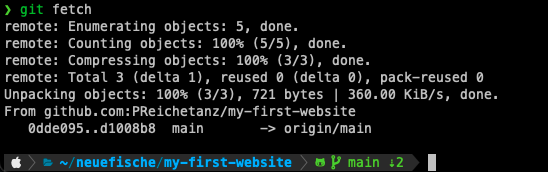
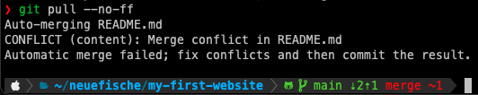
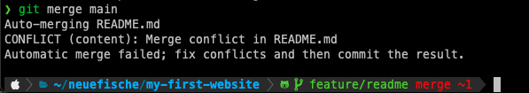

# Git Advanced

## Learning Objectives

- [ ] deepen understanding of git in general
  - [ ] `git fetch`
  - [ ] `git pull`
- [ ] understand why and how git conflicts happen
- [ ] know how to combine branches:
  - [ ] `git merge`
  - [ ] `git rebase` / `git pull --rebase`
- [ ] know how to resolve git conflicts

---

## Understanding Advanced Git Commands

### `git fetch`

To check whether your local branches are up to date with the remote repository (by default:
`origin`), use `git fetch`.

If there are any differences,

- `git fetch` updates the remote-tracking branches
- this means that your local branch knows about all recent remote changes, but **does not contain
  these changes yet**
- you still need to merge these changes manually (using `git pull` or `git merge`).



> 💡 To see exactly which branches are up to date with origin/main, use `git fetch -v`.

### `git merge`

To join two branches together, you can use `git merge`.

Make sure to

- run `git fetch` first if you want to merge a remote branch
- switch to the branch where you want to incorporate the changes
- run `git merge <branchname>`


> 💡 Note that `git merge` is a fast-forward merge by default, which means that it will not create a
> merge commit if the history is clean.

> 💡 If a fast-forward merge isn't possible, `git merge` will create a merge commit, that
> incorporates the change. To avoid this and keep a clean history, you can use
> [git rebase](git-advanced.md#git-rebase).

### `git pull`

You can use `git pull` to fetch changes from a remote repository **and** merge them into the current
branch.

This is possible due to the fact that `git pull` runs `git fetch` and then `git merge`.


### `git rebase`

To join two branches together, you can also use `git rebase`. In contrast to `git merge`, it doesn't
create a merge commit, which results in a cleaner git history.

This strategy first applies all the changes of the branch we are rebasing to (the branch used after
the `rebase` command). Then it applies the changes of the branch we are rebasing from (the current
branch) on top of it commit by commit.

This is like "replaying" your latest changes on top of the changes from the other branch.

To rebase,

- switch to the branch where you want to incorporate the changes
- use `git rebase main` to incorporate the changes from the `main` branch into the branch you
  switched to
- if a conflict occurs,
  - [see below how to solve it in VSCode](git-advanced.md#how-to-solve-conflicts-in-vscode) and
  - [how to finish rebasing](git-advanced.md#option-2-git-rebase)

---

## How to Solve Conflicts

When your create a PR and want to merge the feature branch into the main branch, it happens that
somebody made changes to the same lines of code you were working on. Git cannot decide which code is
the right one and marks it as a conflict.

Conflicts have to be solved manually by developers.

### How to solve conflicts in VSCode

If a merge conflict occurs, you can use VSCode to solve it:

- go to the `Source Control` Tab of VSCode, and open the file marked with ❗️:


- choose one option to resolve the merge conflict:
  - `Accept Current Change`: keep content of the feature branch
  - `Accept Incoming Change`: keep content of the main branch (because we are merging main into the
    feature branch)
  - `Accept Both Changes`: keep both changes
- save the file and stage the changes (`git add <filename>`)
- follow the further steps along [git merge](git-advanced.md#option-1-git-merge) or
  [git rebase](git-advanced.md#option-2-git-rebase)

---

### How Common Conflict Emerge

#### Scenario 1: Feature Branch differs from Main Branch


There are two ways to handle the conflict:

- solve the conflict locally ([see explanation below](git-advanced.md#solving-the-conflict-locally))
- solve the conflict directly on GitHub
  ([see explanation below](git-advanced.md#solving-the-conflict-remote-on-github))

#### Scenario 2: Fatal Error on `git pull`

Using `git pull` can result in the error message `fatal: Not possible to fast-forward, aborting`.
This happens when:

- You have done at least one commit locally.
- In the meantime, somebody else has committed to the branch you want to pull.
- The problem is that git does not know which commit(s) came first.


To solve the conflict, follow these steps:

- `git pull --no-ff`
- resolve merge conflicts (if any)
  ([see explanation below](git-advanced.md#how-to-solve-conflicts-in-vscode))
- `git commit -m "resolve merge conflict"`
- `git push`



---

### Solving Conflicts

#### Solving the Conflict Locally

##### Option 1: `git merge`

If the feature branch has conflicts with the main branch, you can use `git merge` to solve the
conflict:

- go to feature branch
- use `git merge main` to merge the main branch into the feature branch
- the terminal will output something like this:

  

- resolve the conflict in VSCode
  ([as mentioned above](git-advanced.md#how-to-solve-conflicts-in-vscode))
- push the feature branch to GitHub
- conflict solved: you can merge the PR on GitHub 🎉

##### Option 2: `git rebase`

Instead of `git merge`, you can use `git rebase` to solve a conflict:

- go to feature branch
- use `git rebase main`
- resolve merge conflicts step-by-step
  ([as mentioned above](git-advanced.md#how-to-solve-conflicts-in-vscode))
- use `git rebase --continue` to continue (will open an editor for the merge commit message)
  > 💡 Most likely you're in vim. To save and close the editor type `:wq` and press `Enter`.
- `git push --force-with-lease` (protects the remote branch if different from local branch)

#### Solving the Conflict Remote on GitHub

Instead of solving a conflict locally, you can
[use the GitHub conflict manager](https://docs.github.com/en/pull-requests/collaborating-with-pull-requests/addressing-merge-conflicts/resolving-a-merge-conflict-on-github).

---

## Resources

- [Git Handbook](https://www.git-scm.com/docs)
- [Visualizing Git](https://git-school.github.io/visualizing-git/#upstream-changes)
- [Git Emergency Help: ohshitgit.com](https://ohshitgit.com/)

Handout:
(https://github.com/neuefische/allspice-cgn-fssd-25/blob/main/sessions/git-advanced/git-advanced.md?plain=1)
-------------------------------------------------------------------------------------


# Git Advanced

## Learning Objectives

- [ ] deepen understanding of git in general
  - [ ] `git fetch`
  - [ ] `git pull`
- [ ] understand why and how git conflicts happen
- [ ] know how to combine branches:
  - [ ] `git merge`
  - [ ] `git rebase` / `git pull --rebase`
- [ ] know how to resolve git conflicts

---

## Understanding Advanced Git Commands

### `git fetch`

To check whether your local branches are up to date with the remote repository (by default:
`origin`), use `git fetch`.

If there are any differences,

- `git fetch` updates the remote-tracking branches
- this means that your local branch knows about all recent remote changes, but **does not contain
  these changes yet**
- you still need to merge these changes manually (using `git pull` or `git merge`).


> 💡 To see exactly which branches are up to date with origin/main, use `git fetch -v`.

### `git merge`

To join two branches together, you can use `git merge`.

Make sure to

- run `git fetch` first if you want to merge a remote branch
- switch to the branch where you want to incorporate the changes
- run `git merge <branchname>`


> 💡 Note that `git merge` is a fast-forward merge by default, which means that it will not create a
> merge commit if the history is clean.

> 💡 If a fast-forward merge isn't possible, `git merge` will create a merge commit, that
> incorporates the change. To avoid this and keep a clean history, you can use
> [git rebase](git-advanced.md#git-rebase).

### `git pull`

You can use `git pull` to fetch changes from a remote repository **and** merge them into the current
branch.

This is possible due to the fact that `git pull` runs `git fetch` and then `git merge`.


### `git rebase`

To join two branches together, you can also use `git rebase`. In contrast to `git merge`, it doesn't
create a merge commit, which results in a cleaner git history.

This strategy first applies all the changes of the branch we are rebasing to (the branch used after
the `rebase` command). Then it applies the changes of the branch we are rebasing from (the current
branch) on top of it commit by commit.

This is like "replaying" your latest changes on top of the changes from the other branch.

To rebase,

- switch to the branch where you want to incorporate the changes
- use `git rebase main` to incorporate the changes from the `main` branch into the branch you
  switched to
- if a conflict occurs,
  - [see below how to solve it in VSCode](git-advanced.md#how-to-solve-conflicts-in-vscode) and
  - [how to finish rebasing](git-advanced.md#option-2-git-rebase)

---

## How to Solve Conflicts

When your create a PR and want to merge the feature branch into the main branch, it happens that
somebody made changes to the same lines of code you were working on. Git cannot decide which code is
the right one and marks it as a conflict.

Conflicts have to be solved manually by developers.

### How to solve conflicts in VSCode

If a merge conflict occurs, you can use VSCode to solve it:

- go to the `Source Control` Tab of VSCode, and open the file marked with ❗️:


- choose one option to resolve the merge conflict:
  - `Accept Current Change`: keep content of the feature branch
  - `Accept Incoming Change`: keep content of the main branch (because we are merging main into the
    feature branch)
  - `Accept Both Changes`: keep both changes
- save the file and stage the changes (`git add <filename>`)
- follow the further steps along [git merge](git-advanced.md#option-1-git-merge) or
  [git rebase](git-advanced.md#option-2-git-rebase)

---

### How Common Conflict Emerge

#### Scenario 1: Feature Branch differs from Main Branch


There are two ways to handle the conflict:

- solve the conflict locally ([see explanation below](git-advanced.md#solving-the-conflict-locally))
- solve the conflict directly on GitHub
  ([see explanation below](git-advanced.md#solving-the-conflict-remote-on-github))

#### Scenario 2: Fatal Error on `git pull`

Using `git pull` can result in the error message `fatal: Not possible to fast-forward, aborting`.
This happens when:

- You have done at least one commit locally.
- In the meantime, somebody else has committed to the branch you want to pull.
- The problem is that git does not know which commit(s) came first.


To solve the conflict, follow these steps:

- `git pull --no-ff`
- resolve merge conflicts (if any)
  ([see explanation below](git-advanced.md#how-to-solve-conflicts-in-vscode))
- `git commit -m "resolve merge conflict"`
- `git push`


---

### Solving Conflicts

#### Solving the Conflict Locally

##### Option 1: `git merge`

If the feature branch has conflicts with the main branch, you can use `git merge` to solve the
conflict:

- go to feature branch
- use `git merge main` to merge the main branch into the feature branch
- the terminal will output something like this:

  

- resolve the conflict in VSCode
  ([as mentioned above](git-advanced.md#how-to-solve-conflicts-in-vscode))
- push the feature branch to GitHub
- conflict solved: you can merge the PR on GitHub 🎉

##### Option 2: `git rebase`

Instead of `git merge`, you can use `git rebase` to solve a conflict:

- go to feature branch
- use `git rebase main`
- resolve merge conflicts step-by-step
  ([as mentioned above](git-advanced.md#how-to-solve-conflicts-in-vscode))
- use `git rebase --continue` to continue (will open an editor for the merge commit message)
  > 💡 Most likely you're in vim. To save and close the editor type `:wq` and press `Enter`.
- `git push --force-with-lease` (protects the remote branch if different from local branch)

#### Solving the Conflict Remote on GitHub

Instead of solving a conflict locally, you can
[use the GitHub conflict manager](https://docs.github.com/en/pull-requests/collaborating-with-pull-requests/addressing-merge-conflicts/resolving-a-merge-conflict-on-github).

---

## Resources

- [Git Handbook](https://www.git-scm.com/docs)
- [Visualizing Git](https://git-school.github.io/visualizing-git/#upstream-changes)
- [Git Emergency Help: ohshitgit.com](https://ohshitgit.com/)

Handout:
https://github.com/neuefische/allspice-cgn-fssd-25/blob/main/sessions/git-branches-and-prs/git-branches-and-prs.md?plain=1
----------------------------------------------------------------------


# Git CLI & remote

## Learning Objectives

- using version control locally to create repositories and commits
- understanding different states of files
- synchronizing local repositories with remote repositories

---

## Git CLI

You can create git repositories and commits locally. You can also synchronize your local repository
with a **remote** repository (i.e. on GitHub).

### Creating local repositories

To turn a folder into a git repository you need the following git command:

```shell
cd path/to/my/folder
git init
```

> ❗️ Do not initialize a git repository inside another git repository!  
> To check if a folder has already been initialized you can run the following git command
>
> ```shell
> git status
> ```
>
> Not a git repo:
>
> ```shell
> fatal: not a git repository (or any of the parent directories): .git
> ```
>
> A git repo:
>
> ```shell
> On branch main
> nothing to commit, working tree clean
> ```

---

## States of files

On GitHub, we can create, modify and delete files, the same can be done via the terminal. To
understand how this works, we have to know about the different states a file can have.

### Untracked files

The file has not been added to git.

### Tracked files

Tracked files can be in different states:

| state     | description                        |
| --------- | ---------------------------------- |
| modified  | Has changes since the last commit  |
| staged    | Is included in the next commit     |
| committed | All changes have been saved in git |

---

## Committing in a local repository

We recommend executing the following git commands for every completed task:

> 💡 Hint: Commits help track your progress.  
> Commit early, commit often.  
> Make sure, that your code works as expected.

| Git command               | Git task                                         |
| ------------------------- | ------------------------------------------------ |
| `git status`              | List all files that have changed and their state |
| `git add <filename>`      | Add a file to the stage                          |
| `git commit -m "add foo"` | Create a commit including all staged files       |
| `git log --oneline`       | Show the commit history                          |


---

## Using commits as backups

You can always return to the last committed state of the entire project:

```sh
git restore .
```

You can also restore individual files:

```sh
git restore <filename>
```

---

## Connecting to a remote repository

This enables teams to work on the same remote repository and clone it locally. The remote repository
also serves as a backup.

### Connecting your local repository to a new remote repository

The first thing you need to do is create a new empty remote repository on GitHub. You will then see
some hints e.g. "...or push an existing repository from the command line". **Copy the commands from
GitHub** and execute them in your local project folder.

**Example:**

```
git remote add origin git@github.com:GitHubUsername/repository-name.git
git branch -M main
git push -u origin main
```

### Cloning a remote repository

You can create a copy of the remote repository on your local machine with the following command:

```shell
git clone <url>
```

> 💡 You can find the url of remote repositories on GitHub on the repository page. Please use the
> SSH url.


### Synchronizing local & remote repositories

| Git command | Git task                                    |
| ----------- | ------------------------------------------- |
| `git push`  | Upload content to the remote repository     |
| `git pull`  | Download content from the remote repository |

---

## Resources

- [Connect with SSH Docs on GitHub](https://docs.github.com/en/authentication/connecting-to-github-with-ssh/about-ssh)
- [Git SCM](https://git-scm.com/)
- [Git book](https://git-scm.com/book/en/v2)
- [Git Cheatsheet](https://training.github.com/downloads/github-git-cheat-sheet/)

Handout:
https://github.com/neuefische/allspice-cgn-fssd-25/blob/main/sessions/git-cli-and-remote/git-cli-and-remote.md?plain=1
----------------------------------------------------------------------

# GitHub and Markdown

## Learning Objectives

- learning what version control is and why it is useful / important
- creating repositories on GitHub
- creating / editing files on GitHub
- creating commits on GitHub
- learning what Markdown is
- writing Markdown

---

## Markdown

The Markdown syntax allows writing formatted text (headlines, blockquotes, lists, etc.) that can be
stored in plain text. It is used by tools and websites like GitHub or Slack. It uses specific
characters to format parts of the text in a certain way.

### Markdown Examples

| Element                         | Markdown Syntax                   |
| ------------------------------- | --------------------------------- |
| Level 1 headline                | `# Level 1 headline`              |
| Level 2 headline                | `## Level 2 headline`             |
| Level 5 headline                | `##### Level 5 headline`          |
| list item                       | `- list item`                     |
| [ ] done                        | `[ ] checkbox`                    |
| [x] done                        | `[x] checkbox`                    |
| **bold text**                   | `**bold text**`                   |
| _italicized text_               | `_italicized text_`               |
| [link](https://www.example.com) | `[link text](https://www.example.com)` |
| image                           | ``           |
| block quote                     | `> block quote`                   |
| divider                         | `---`                             |
| `inline code block`             | `` `inline code block` ``         |
| `code block`                    | ` ``` code block ``` `            |

See this [Markdown Cheatsheet](https://github.com/adam-p/markdown-here/wiki/Markdown-Cheatsheet) for
more Markdown Syntax.

---

## Git & Commits

Git is an open source version control system that:

- keeps track of all changes made to the source code
- enables developers to easily collaborate on the same project and exchange updates
- enables developers to go back to earlier versions of the source code

### Git Repositories

A Git repository is a place where a project is being saved. It keeps track of all versions of the
project files. Many people can have access to (and work on) the same repository.

### Commits

A commit is a **snapshot of your repository** at a specific point in time. Creating a commit in your
project is similar to hitting the **save** button in a video game.

You can always **go back to any prior commit** and will have all the project files as they were when
you made the commit.

Each commit has a message which should include a descriptive text, so that you and other developers
will know what changes the commit includes.

### Good commit messages

Writing good commit message is an art form in itself. Try to stick to the following rules:

- Be short and descriptive
- Always use english
- The first word should be a verb: "add", "fix", "remove", etc.
- Use imperative and present tense: "add shop page" instead of "added shop page"
- Do not end your commit message with a period
- When in doubt, describe **why** you did something instead of **how**: "fix typo" instead of
  "replaced the letter a with an e in the second word"

Your commit messages are a protocol of all changes made to the code base. Other developers should be
able to understand what happened by reading the commit messages.

---

## GitHub

GitHub is an online platform where you can store, share and collaborate on **remote** git
repositories. With GitHub, the same codebase can be shared and edited across many collaborators.
Many repositories are open source, so you can view the code, create a copy, modify it or use it in
your own projects.

> 💡 Hint: Check out this huge
> [list of GitHub repositories](https://github.com/pawelborkar/awesome-repos) and see what you can
> find there.

At the same time GitHub is a social network for developers and companies. Your GitHub profile will
be a valuable public asset for your future career. You can get in contact with many open source
projects, developers and even companies via GitHub.

> 💡 Even though GitHub is the most popular online git platform, it is by far not the only one.
> There are several alternatives to GitHub, i.e Gitlab or Bitbucket.

<br>
<br>

---

## Resources

- [Markdown Cheatsheet](https://github.com/adam-p/markdown-here/wiki/Markdown-Cheatsheet)
- [GitHub Profile Readme](https://docs.github.com/en/account-and-profile/setting-up-and-managing-your-github-profile/customizing-your-profile/managing-your-profile-readme)
- [List of awesome GitHub profile readmes](https://github.com/abhisheknaiidu/awesome-github-profile-readme)

Handout:
https://github.com/neuefische/allspice-cgn-fssd-25/blob/main/sessions/github-and-markdown/github-and-markdown.md?plain=1

--------------------------------------------------------------------------------
